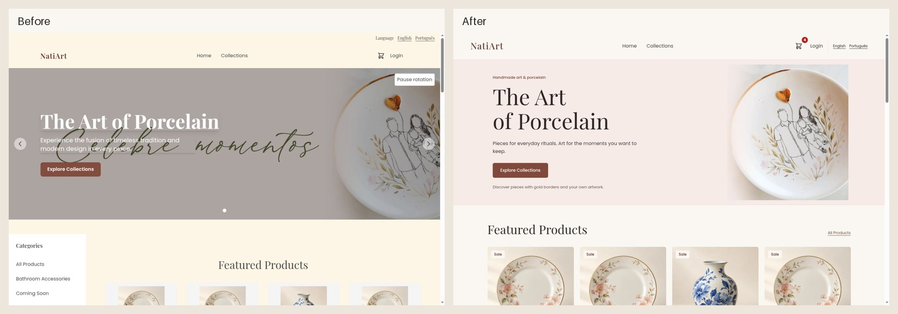
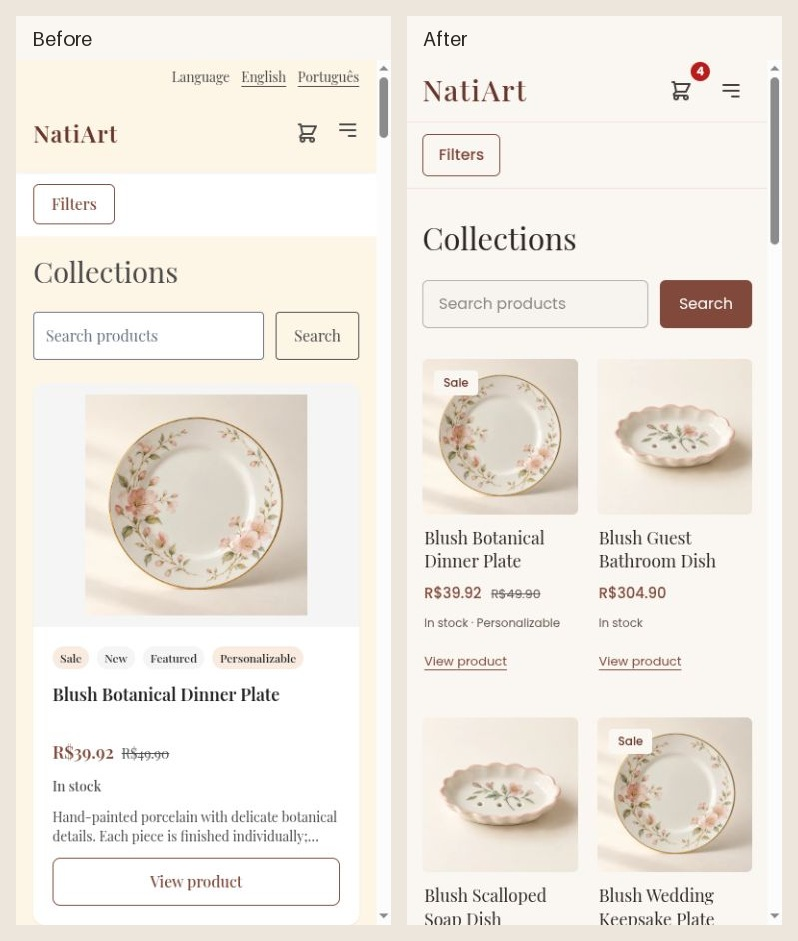

# NatiArt atelier redesign

**Latest:** the [October 8 refinement pass](refinement/README.md) adds a more
distinctive composition across the shop, fixes mini-cart/checkout behavior,
repairs a reproduced authentication-cache race and records fresh verification.
The findings, screenshots and counts below preserve the first pass.

Implemented October 7–8, 2026 on `feature/atelier-storefront`, from master
`1e922119`. [Open the Portuguese preview](http://localhost:4200/pt-BR/dashboard)
or [English preview](http://localhost:4200/en/dashboard).

The storefront now uses an ivory and restrained rose palette, expressive serif
headings, readable sans-serif controls, and consistent product photography.
Discovery, personalization, cart, checkout, authentication, account and admin
share those foundations. This is an implementation in the existing Angular app;
the first pass kept backend source unchanged. The refinement's focused cache
repair is documented separately; payment contracts and architecture are preserved.

## Audit context

Read the mandatory frontend instructions and the theme, accessibility,
navigation, forms, image, checkout, payment and admin module contracts before
editing. Preserved the pre-existing untracked `backend/design-review/` work.
The initially running bundle redirected Home to Login while current source
already allowed public browsing. Rebuilt current master before taking the new
baseline; an isolated build of that same commit supplied equivalent comparison
screens. Historical reports describe an older commit and are not new evidence
of unresolved defects.

The earlier repeat-checkout, fulfillment details, selected-reference, public
browsing, mobile-filter, contrast, route-focus and password-guidance repairs are
already present. Retained their contracts and regression tests. Two actual local
purchases verified repeat checkout; admin verified the new gold-border order's
saved details and fulfillment transition. Fixture photos and repeated demo copy
are explicitly synthetic and are not commercial-content defects.

## Direction considered

| Direction | Character | Decision |
| --- | --- | --- |
| Contemporary atelier | Ivory, rose, editorial headings, quiet controls and artwork-led grids | Selected: builds on the actual porcelain, local fonts and existing brand without slowing commerce. |
| Collector's gallery | Stark white, dark ink, oversized work labels and sparse prices | Good for art viewing; weaker at communicating this store's everyday gifts and purchase options. |
| Colorful gift studio | Brighter accents, playful type and occasion-led navigation | Could suit campaigns; adds taxonomy/content dependencies and competes with the detailed artwork. |

See [the compact design system](design-system.md), [verification and route map](verification.md),
and [measurement plan](measurement-plan.md).

## Findings and acceptance

R = reproduced/rendered behavior; C = code finding; V = visual judgment;
H = usability hypothesis; B = business-content dependency. Priorities are relative
to this redesign; effort S/M means small/medium frontend work.

| Finding / evidence and affected task | Change / expected benefit | Priority, effort, dependencies | Acceptance / result |
| --- | --- | --- | --- |
| R/V: Home had Previous, Next, Pause and slide controls for one image; phone controls sat over a cropped banner. Baseline Home screenshots. Task: understand the shop and begin browsing. | One static hero, real Collections link, separate copy and artwork. Removes a decision and stops decorative rotation. | P1, M; existing approved `a1.webp`. | No carousel controls/timer; subject and copy visible at all five widths. Passed. Mobile source asset still contains baked Portuguese text; replacement asset is a content dependency. |
| V/H: Separate language strip, large header and Home category sidebar delayed product discovery. Baseline Home/catalog. | Compact header, language links in desktop navigation/mobile dialog; category filtering remains in Collections. | P2, M; route/query and dialog contracts. | Same current route/query after locale switch; mobile menu Enter/Escape and focus restoration verified. |
| V/H: Up to four badges, full descriptions and two actions made Home cards dense; recommendations used a separate layout. Baseline cards/detail. Task: compare pieces. | Shared square, contained photo; at most one sale/new badge; title, prices, availability, personalization and one detail action. | P1, M; existing product/image DTOs. | Home, Collections and recommendations use shared cards; sold-out, long-name and R$1,299.90 fixtures fit. Passed. No invented scarcity. |
| C/R: Personalization reset/closed around submission; a failed freshness request could discard selected options. Task: configure a piece without redoing work. | Choose options CTA; retain dialog, gold/file selection and inline error until actual cart acceptance; pending/cancel guards and honest added status. | P1, M; current-product check, cart and native-dialog ownership. | Real local 503 retained gold; retry succeeded; tests cover retained File, cancellation, duplicate prevention and stock-cap feedback. Live upload blocked by browser permission, explicitly not claimed passed. |
| V/H: Broad serif body text, heavy shadows and varied controls made shopping, forms and admin feel separate. Baseline cart/auth/admin. | Poppins interfaces, Playfair display, warm surfaces, restrained borders and shared 44px actions/48px inputs. SVG quantity icons. | P2, M; global tokens/projected controls. | 160 rendered layouts across both locales fit without page overflow; enabled semantic text/action pairs meet AA contrast. Passed for inspected layouts. |
| R/V: Light sign-in caption text over the pale plate was hard to read. Final desktop sign-in inspection. | Remove redundant on-photo marketing copy and make Welcome Back the page heading. | P1, S; existing approved photo. | Sign-in has a clear heading and readable form; photo remains unobstructed. Passed. |
| V/H: Customer detail exposed operational packaging; product photography and recommendations had inconsistent proportions. | Hide packaging from customer detail, retain admin references; square contained gallery and shared recommendations. | P2, S; no DTO/security change. | Real gallery selection and keyboard zoom work; packaging remains in product editor. Passed. |
| C/H: Forms lacked several useful autofill hints/input modes; final progress state was visually weak. Task: complete checkout accurately. | Given/family/email/tel and separate shipping/billing autofill; numeric CPF/CEP; readable active step and Checkout heading. | P1, S; required validation and quote flow. | Profile prefill, required-name recovery, mandatory house number, real quote/final breakdown and PIX all verified. No fields/validation removed. |
| R/C: Cart shipping feedback and several admin editor labels appeared in English in Portuguese. Generic cart estimate could be mistaken for a final basket quote. | Translate all estimator states/editor labels, localize BRL output, clarify provisional estimate and improve CEP error association. | P1, S; server quote unchanged. | Both locale builds have complete active-message translations; Portuguese cart shows translated guidance. Final charge still comes from checkout quote. Passed. |
| V/C: Order history presented long IDs prominently and lacked usable same-route retry; load-more failures could hide loaded orders. Task: inspect or purchase again. | Short reference, expandable full ID/address/charge, linked purchased items; retain loaded orders and retry failed page/owned-order request. | P1, M; account-scoped OrderService. | New owned order accessible from PIX success; links return to products; recovery tests pass. Paid attempt clears and a distinct second payment completes. |
| R/C: Lazy-route loading moved the footer; uncompressed static code and TTF fonts increased transfer. Task: see useful content sooner. | Reserve routed content height, full-glyph WOFF2 local fonts, preload body/display faces, compress text/static assets in Nginx. | P1, M; original licenses/font provenance and container contracts. | CLS 0 in final cold mobile lab runs; font bytes down about 67%; container replacement/proxy/cache checks pass. LCP varied 4.8–8.7s and remains above target. |
| R: Rapid authenticated reads intermittently failed in the local H2 fixture. Logs show unique-key collisions in token-validation cache/rate-limit storage. Task: load admin lists/options. | Existing error/retry surfaces retained. Record a separate focused backend investigation. | P1 follow-up, M; concurrent Java25 reproduction and PostgreSQL comparison. | Do not treat a retry as a backend fix. Fail-closed auth unchanged; no production-database/concurrency fix claimed. |
| B: Maker story, contact details, shipping/returns policy and clean localized campaign artwork need business input. | Keep unpublished links/features absent; use existing approved care content and assets. | P2 content; owner-supplied facts/assets. | No invented policy, reviews, biography, promises, newsletter or inert favorites controls. Dependency remains. |

## Implementation checklist

- [x] Shared palette, typography, spacing, image ratios, controls and focus/motion rules.
- [x] Static Home, compact navigation, locale preservation, search/category/page controls.
- [x] Shared merchandising cards, contained detail/gallery/recommendations and SVG quantities.
- [x] Personalization feedback, failure retention, cancellation and accepted-quantity status.
- [x] Cart/forms/checkout/PIX/account/auth/admin visual consistency and translated feedback.
- [x] Detail and order-history same-route recovery; load-more order preservation.
- [x] Local WOFF2 font delivery, static compression and layout-shift reduction.
- [x] Production builds, 375 browser specs, container checks, responsive screenshots and two local purchases.
- [ ] Live custom-file chooser/upload: requires Chrome extension file-URL access.
- [ ] Full assistive-technology audit, production providers/email and field Core Web Vitals.
- [ ] Focused backend cache-concurrency repair and approved business-content completion.

## Representative evidence

Desktop Home, before and after:

Phone Collections, before and after:

Every comparison image is assembled from actual browser screenshots. See the
`screenshots/` directory for original captures; `before/after-{locale}-{width}`
filenames identify equivalent public screens. Commerce/admin captures use the
same local fixture but its order history changes after the documented test
purchases. Screenshots contain only demonstration merchandise/customer data.
