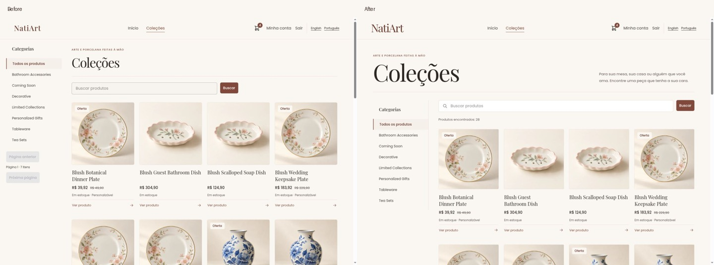
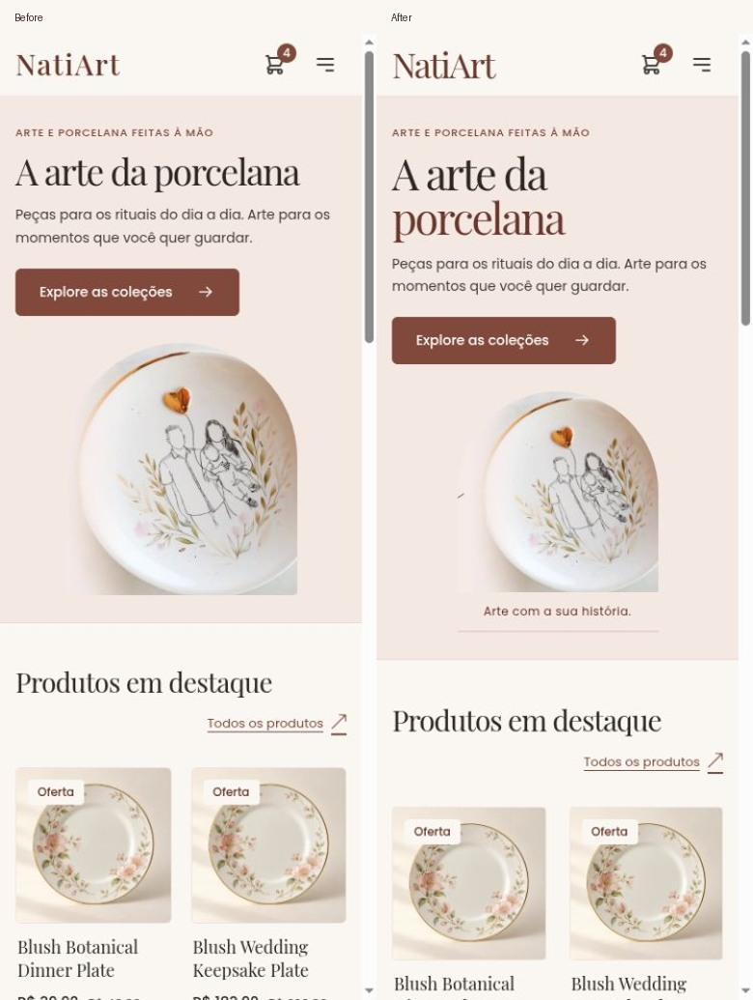

# Bold gallery refinement — October 8, 2026

This pass continues from published master `6edb3510` (PR #400). It adds a stronger
editorial gallery composition to the existing warm atelier direction. The
[previous refinement](../refinement/README.md) and [original review](../README.md)
remain historical evidence. No backend, merchandise assets, payment contracts,
dependencies or tracking services changed in this pass.

Preview: [Português](http://localhost:4200/pt-BR/dashboard) / [English](http://localhost:4200/en/dashboard).

## Direction and implementation

The original review considered atelier, collector gallery and colorful gift
studio directions. This iteration borrows the gallery's display scale and clean
alignment while retaining the atelier's warm palette, readable controls and
ordinary shopping interactions. Expressive type and real artwork carry the
identity. Additional decorative imagery or animation would compete with the
porcelain and add loading cost.

- Larger NatiArt wordmarks, a two-tone Home title, a captioned approved artwork
  frame and a stronger personalization story carry the brand across the page.
- The phone artwork frame shrinks from 240px to 208px while the heading becomes
  stronger; the product subject remains visible without the source's lettering.
- Home's four-piece grids remain balanced: one column below 380px, two through
  tablet sizes, four from 1024px. At 1280px the fourth product no longer sits alone.
- Collections has an oversized introduction, purposeful search/result context,
  a quiet category rail and shared artwork-led cards. The desktop rail remains
  below the header while scrolling and scrolls internally on short viewports.
- Detail groups the authoritative price, quantity, purchase action and available
  personalization in a labelled purchase panel. A persistent corner zoom icon
  makes the existing keyboard gallery interaction easier to discover.

The existing local fonts, semantic palette, 44px actions, 48px fields, reduced
motion rules and contained merchandise photographs remain the design foundation.
See [theme decisions](../../../../frontend/natiart-app/src/app/shared/docs/theme-and-fonts.md).

## Findings, evidence and acceptance

R = reproduced behavior; C = code finding; V = visual judgment;
H = usability hypothesis. All dependencies below already exist in the app.

| Screen / finding and affected task | Change and expected benefit | Priority / effort / dependency | Acceptance and evidence |
| --- | --- | --- | --- |
| V/H: Collections looked flatter than Home, with its title subordinate to the rail. Task: begin browsing and compare pieces. | Gallery introduction, more deliberate proportions and quiet shared captions make the shop feel coherent. | P2 / M / existing fonts and card. | Matched desktop/phone images and both-locale five-size review; no clipped controls. Visual quality is a judgment, not proven conversion uplift. |
| C/R: Category links discarded a committed search. Task: narrow a search without starting again. | Merge query parameters when switching/clearing categories; retain search and reset page zero. | P1 / S / existing router and paged API. | Real search→Tableware→Back→locale journey retains query/category; HTTP/router spec verifies requests and history. |
| R: Clear search initially lost focus to the shell's route heading. | Transient router info asks the shell to focus search after rendering; ordinary navigation still focuses headings. | P1 / S / existing shell focus contract. | Live Clear search/Enter restores the input; a new shell test checks one-time focus and normal navigation afterward. |
| R: A submitted search still triggered the unsaved-form language warning. | Mark submitted/router-synchronized search pristine, including a repeated whitespace-only edit; retain confirmation for unsubmitted edits and other forms. | P2 / S / existing NgForm and locale guard. | Submitted search changes locale without a warning and preserves filters; cancellation/stale-response test also verifies pristine state. |
| V/C: Short category/search lists displayed disabled paging controls. | Show paging only for another/previous page, loading or error recovery; announce the API result count. | P2 / S / existing page envelope and retry. | Single-page results omit inactive controls; first 20 of 28 products still expose Next; retry tests remain green. |
| C/R: Sticky rail was constrained by its own short host. | Stretch the host to the result list while bounding the rail itself. | P2 / S / existing flex layout. | After a real PageDown at 1440px, rail top remains 104px with a 2505px host; [scroll screenshot](category-rail-scroll-pt-1440.jpg). |
| V/H: Detail price/options lacked grouping and zoom appeared only on hover. | Purchase panel, stronger price and persistent decorative zoom affordance. | P2 / S / current price, stock and personalization contracts. | 320px large-price/sold-out fixtures fit; Space toggles zoom, Cancel closes options and restores the purchase opener. |

## Verification

- [x] Final production build succeeds for both locales; existing heic2any CommonJS
  and `pt-BR`→`pt` locale-data warnings remain.
- [x] **384 ChromeHeadless specs pass**, Chromium 153; two meaningful state/focus
  tests added. Existing cart, checkout recovery, payment confirmation, artwork,
  stale-request/retry and dialog tests remain green.
- [x] Production artifact verifier plus its **5 tests pass**; all **505 active
  messages** have Portuguese translations, including the new labels/placeholders.
- [x] [50 recorded layouts](layout-checks.json): Home/Collections/detail at
  320/390/768/1280/1440 in both locales (30), cart/account/checkout first step/care
  at 320/1440 (16), large-price and sold-out detail at 320 in both locales (4).
  No document horizontal overflow; no clipped controls in the recorded checks.
- [x] Additional native browser checks: 200-character empty search and Clear
  recovery; phone Filters open/select/close; category/search/Back/locale
  preservation; gallery Space zoom; gold option selection/Cancel/opener focus;
  phone-menu Enter/Escape/opener focus; basket quantity update after server reply;
  desktop sticky rail; deferred Home photos load after scrolling.
- [x] Full Home/story/footer and representative secondary screenshots visually
  inspected. The enlarged typography and purchase controls remain readable.
- [x] Existing 27 owner fixture files retain their original SHA-256 hashes and
  remain untracked. Local fixture transactions from prior passes are preserved.

Local build/test runtime: Node 26.10.0/npm 12.2.0. CI separately uses Node 24 and
runs the production container, real Java 25 product metadata boundary, font
headers and container replacement checks before merge. This is frontend-only;
no Java code changed. The final CI outcome is recorded in the PR/final delivery.

The Chrome review connection stalled on the earlier native language confirmation;
subsequent documented recovery attempts also timed out. The remaining review
used a fresh in-app browser against the same production Nginx build and services.
Final main screenshots match the before routes, product, locale, widths and
same shopper session/cart. To eliminate initially unfinished photo captures,
published-master assets were temporarily served under `/_baseline/pt-BR/` on
4200 with only their HTML base path adjusted. This retained the fixture's real
origin checks and existing session, without changing backend validation. All
first-row product photos were confirmed decoded before capture. The temporary
mapping/assets were removed afterward. The separate 4300 lab control remained
unchanged; its attempted sign-in was correctly rejected by the fixture's origin
allowlist and was not treated as a production defect. Secondary cart images are
additional state coverage, not matched comparisons.

New payment transactions were not created during this pass. The previous
[verification](../refinement/README.md) records two local purchases, authoritative
PIX success, cart removal and subsequent purchase. This pass verifies the changed
purchase presentation plus the existing automated commerce contracts.

## Before / after

Before images show the published master build; after images show this refinement.
Both desktop panels use 1440 CSS pixels and phone panels 390 CSS pixels. Original
unscaled captures and the rest of the responsive matrix are retained here.

[Product desktop](after-product-pt-BR-1440.jpg),
[product phone](after-product-pt-BR-390.jpg),
[complete Home desktop](home-full-pt-1440.jpg),
[complete Home phone](home-full-pt-390.jpg),
[phone personalization](personalization-pt-320.jpg),
[long empty search](search-empty-long-en-320.jpg),
[phone menu](menu-pt-390.jpg).

## Performance and remaining limits

Two quiet sequential cold mobile runs used Lighthouse 13.5.0 / Chromium 153,
production Nginx, isolated guest profiles, 412×823 CSS pixels, scale 1.75,
default simulated mobile network and 4× CPU slowdown. Their configurations
match the earlier lab reports. [Run 1](performance-1.json) and
[run 2](performance-2.json) retain settings and results.

| Metric | Master control 1 | Master control 2 | Bold run 1 | Bold run 2 |
| --- | --- | --- | --- | --- |
| Performance score | 79 | 80 | 79 | 79 |
| LCP | 5.05s | 4.89s | 5.05s | 5.04s |
| CLS | 0.00003 | 0.00003 | 0.00003 | 0.00003 |
| TBT | 44ms | 35ms | 38ms | 37ms |
| Speed index | 2.23s | 2.22s | 2.23s | 2.22s |
| Home automated accessibility score | 100 | 100 | 100 | 100 |

The fresh [control 1](control-1.json) / [control 2](control-2.json) build uses an
isolated source archive of published master `6edb3510`, the same installed locked
dependencies, Nginx image/configuration and fixture services. Its temporary
loopback port is 4300; the new storefront stays available at 4200. All Lighthouse
settings match. Runs were sequential without build/test/browser overlap. These
samples show broadly similar local performance, not a demonstrated speedup.
The earlier 85/4.0s audits predate the final upstream mobile integration and are
retained in their original review rather than used as this pass's control.

The lab measurements preceded the final same-query whitespace/pristine fix in
lazy Collections; Home's design, assets, loading strategy and shell focus code
were unchanged afterward. The final full tests/build/artifact checks cover that
fix, with an additional live repeat-submit check.

LCP remains above 2.5s; field p75 LCP/INP/CLS are unknown, and TBT is not INP.
Local audits establish neither conversion uplift nor whole-app WCAG conformance.

Live custom-file upload remains limited by Chrome extension file-URL permission;
actual 400% browser zoom, full screen-reader/whole-app accessibility review and
production provider/email checks remain open. Business-approved maker/contact,
shipping/returns facts and clean campaign originals remain content dependencies.
No invented promises, reviews, discounts, scarcity or newsletter features were added.

## Next experiments

Use the existing [measurement plan](../measurement-plan.md); no tracking service
was introduced. Keep analytics free of identity, address, artwork and payment data.

1. **Gift discovery:** test the stronger gallery composition and preserved search
   in Portuguese phone tasks. Measure correct product-detail reach and task
   completion, then purchase completion with equivalent merchandise/traffic.
2. **Personalization confidence:** observe purchase-panel/zoom discovery and option
   or shipping-error recovery. Measure retained-choice completion and quote-to-order
   completion; verify participants understand the authoritative final charge.
3. **Repeat purchase:** test owned-order product links for returning customers.
   Measure second confirmed purchases over 60/90 days inside authorized aggregate
   backend reporting, separately from same-session checkout completion.
