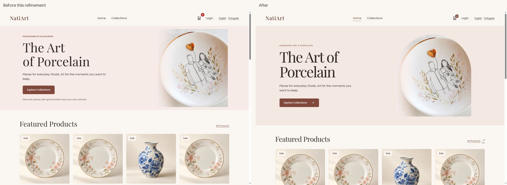
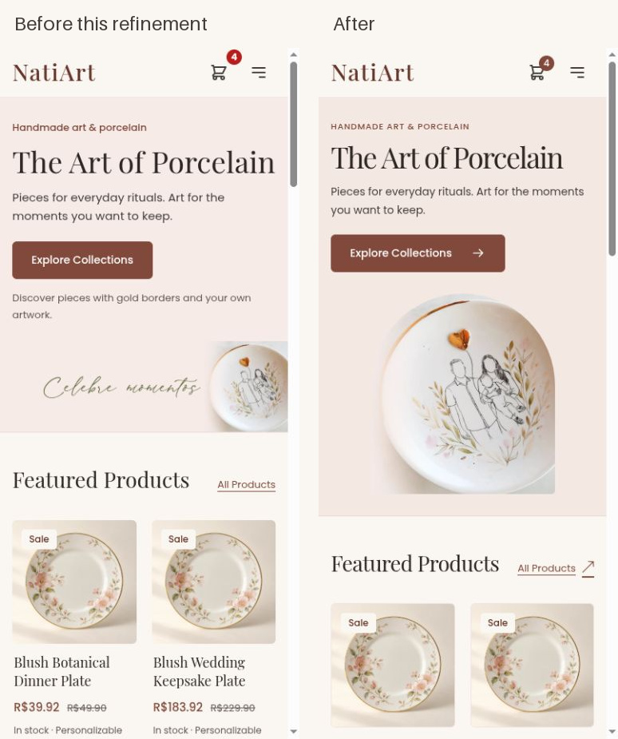

# Atelier refinement — October 8, 2026

[Portuguese preview](http://localhost:4200/pt-BR/dashboard) ·
[English preview](http://localhost:4200/en/dashboard)

This second pass builds on the existing uncommitted atelier redesign. It makes
the composition more distinctive across discovery, detail, basket, checkout,
authentication, account and administration, and repairs newly reproduced
interaction failures. Existing payment, ownership, recovery and validation
contracts remain intact. The only backend change addresses a demonstrated
token-validation cache race. This evidence was captured before Git integration; the completed source and
review artifacts are committed. See [integration verification](integration.md).
No production deployment was performed.

## Direction and tradeoffs

Retain the contemporary atelier direction: warm ivory, clay, restrained rose,
Playfair display and Poppins interfaces. An arched portrait frame for the existing
approved artwork gives Home and authentication a shared visual signature. The
phone crop now shows the complete porcelain illustration and excludes the
source image's baked Portuguese lettering. Copy and the Collections action
remain separate and above the artwork. The taller frame delays the first product
row by roughly 100px compared with the first pass; its clearer artwork is a
design judgment to validate against discovery/completion measures.

Product photography leads quiet square cards with fine borders, ink prices and
ruled detail links. Home shows four featured pieces, a rose personalization
statement, then four distinct new pieces in server order. Collections retains
its complete search/filter/pagination behavior. Product detail puts price,
quantity and the purchase decision ahead of long supporting descriptions.
Authentication, recovery, informational pages, account and admin carry the same
type, proportions and restrained surfaces. No invented maker story, reviews,
delivery promises, policy, product imagery or marketing controls were added.

## Findings, interventions and acceptance

R = reproduced behavior; V = visual judgment; H = usability hypothesis.
Priority is relative to this refinement; S/M indicates small/medium effort.
Screenshots below show the exact local fixture; its demonstration photography
and repeated descriptions are not reported as production content defects.

| Finding / task / evidence | Intervention and expected benefit | Priority, effort, dependency | Acceptance and result |
| --- | --- | --- | --- |
| V/H: Home's rectangular crop and narrow display hierarchy felt generic. Phone image retained baked Portuguese lettering. `home-before-*`. Task: understand the shop and begin browsing. | Larger display hierarchy, clay surface and arched subject crop; purposeful Collections arrow. Clearer brand and subject. | P2, M; existing approved `a1.webp`. | Subject visible, no source lettering, CTA above artwork at all five widths/both locales. Passed. Taller phone hero is an explicit research tradeoff. |
| V/H: Long Home lists repeated pieces and made a dense first impression. Task: compare pieces and understand customization. | Four featured/four distinct new pieces, quiet cards, personalization statement with a real Collections link. | P2, M; existing featured/new API ordering. | Eight cards, no cross-section duplicate IDs; lists still expose loading, error/retry and empty state. Tests and rendered inspection passed. Sold-out new merchandise remains truthful. |
| R/C: Below-fold photos began fetching as blobs immediately; hero was discovered after lazy Home code. Task: see useful content sooner. | Activate new-section photos near the viewport; preload the hero only on Home responses. | P1, M; ImageCollection lifetimes, Nginx locale routes. | Real browser showed four loaded featured blobs and deferred new placeholders, then four loaded new blobs after scrolling. Observer/request cleanup tests and preload route guards pass. |
| V/H: Purchase controls followed long detail copy; single-photo thumbnails duplicated the main image. Task: inspect/buy. | Price/quantity/CTA before details, linked category, omit single thumbnail; native multiple-photo buttons. | P1, S; existing stock/options/gallery contracts. | Detail controls visible earlier; keyboard Enter selected gift-set image 3, Space toggled zoom. Both locale layouts fit. |
| V/H: Tablet cart table crowded content; optional estimate preceded checkout on phones. Task: confirm basket and continue. | Cards below 1024px; linked product names, contained photos and summary/CTA before mobile estimator. | P1, S; cart and shipping estimate contracts. | Summary/action visible earlier on phones; all five widths fit; existing confirmation/artwork/stock recovery preserved. |
| R: Mini-cart stayed open after pointer exit. Task: browse without an obstructing panel. | Correct the delayed close, cancel on re-entry, clear timers and support Escape. | P1, S; shared header. | Timer exit/re-entry/destruction regression passes. Live Escape closes the preview. |
| R/C: Direct mini-cart model binding could assign invalid input to a stored cart item. Task: edit quantity safely. | Reject non-integer/blank input through CartService and restore the displayed value. | P1, S; cart validation. | Native input changed four vases to two, blank input restored two, and four were restored afterward. Regression passes; no invalid cart mutation. |
| R: Escape inside mini-cart removed the focused control and dropped focus to the page. | Return focus to the cart link only when dismissal originates inside the preview. | P1, S; native field/menu interaction. | Rendered regression covers restoration and no outside-focus stealing; final browser check verifies the link receives focus. |
| R: Advancing from a long phone shipping form left the viewport below the payment form. Task: review and place order. | Focus and reveal the newly rendered step heading, including Back and recovery transitions. | P1, S; validation and authoritative quote. | At 390px Shipping/Payment headings focused at 96px below the sticky header; Back retained house number 123. Regression covers forward/back and initial focus. No new order submitted. |
| V/H: Pre-quote summary could look empty and repeated shipping headings added clutter. Task: understand charges. | Label estimated subtotal; explain final price/shipping confirmation; one shipping-step title. | P1, S; authoritative quote unchanged. | Rendered regression replaces estimated prices with differing server prices. Local review showed item R$91.96, shipping R$23.90, total R$115.86. |
| V/H: Authentication, recovery and informational screens had inconsistent spacing and redundant headings. | Shared arched artwork/open forms, one signup heading, more purposeful recovery/info composition. | P2, M; existing account/form contracts. | Login/register/password/info layout matrix passed; sign-in/out preserved the four-item guest basket. Required fields and password recovery behavior retained. |
| V/R: Admin faded entire inactive cards, hid controls at the bottom of long editors, and struck through equal original/current prices. Task: edit safely and understand availability. | Readable dashed inactive cards, explicit labels, quieter actions, conditional actual price reduction, integrated tabs and sticky named Close. | P1, M; editor write guards/native dialog. | Inactive controls readable, no equal-price strike-through; 320px Portuguese product editor Close worked after scrolling, restored Edit focus/body scrolling. Pending/destructive protections retained. |
| V/H: Raw fulfillment transitions and generic account statuses were hard to scan. Task: inspect progress/shop again. | Human transition labels and semantic status pills with text; clearer Continue shopping. | P2, S; server-allowed transitions. | Both locale account/fulfillment layouts fit; order states/allowed transitions unchanged; existing order detail/retry coverage passes. |
| R: Cold parallel protected reads returned an intermittent 503. Logs identified a committed unique-key collision in token cache. Task: open account/admin. | Three bounded cache-write attempts, each through the existing transaction proxy after rollback. | P1, M; Java25/JPA/security. | Before: 23/24 order reads successful. After: 24/24. Real committed H2 race and persistent-failure regressions pass. No in-memory cache or auth bypass; PostgreSQL concurrency remains unverified. |

## Verification and evidence

- Production build passed for both locales. Existing CommonJS `heic2any` and
  pt-BR → pt locale-data warnings remain; active Portuguese translations are
  complete (491 unique active message IDs, zero missing).
- Full frontend suite: **382 ChromeHeadless specs passed** on Chromium 153.
  Added state-handling coverage includes bounded/excluded Home selection,
  image deferral, hover timer, invalid quantity, summary authority, checkout step
  focus and mini-cart Escape focus. Existing payment/idempotency, artwork/image
  ownership, retry, auth, dialog, form and navigation coverage stays green.
- Java25 product-service `compileJava`, `compileTestJava`, `test` and `bootJar`
  passed: **503 tests**, zero failures/errors/skips. Two filter regressions and
  a committed JPA concurrency regression cover the cache change. See
  [the module contract](../../../../backend/product-service/docs/authentication-cache-concurrency.md).
- Container rollout passed release replacement, locale/deep links, runtime
  configuration/cache headers, retained chunks, API proxies, rollback and
  startup rejection. Added Home-only hero preload checks cover both locales,
  locale root/dashboard/trailing slash/query and absence on other routes.
- [Layout matrix](layout-checks.json): **160 unique layouts**, 16 screens × two
  locales × 320/390/768/1280/1440 CSS-pixel viewports, height 900px. No measured
  page overflow. Latest Home/checkout captures replace their earlier refinement
  frames. Native screenshots contain the browser's visible content region;
  scrollbar/provider framing makes bitmap dimensions smaller than the requested
  CSS viewport. Before/after pairs have exactly matching bitmap dimensions.
- Local fixture verification passed: 32 products, 34 WebP images, 24 categories,
  24 packages, **24 consistent orders**, both logins. Original two completed local
  purchase journeys remain documented in the [first-pass verification](../verification.md).
  This refinement stopped at payment review and created no additional order.
- `git diff --check` passed. Source and running production preview match. Owner's
  existing `backend/design-review/` work is preserved; resume instructions remain
  in the first-pass verification.

Actual captures include all matrix routes plus [mobile personalization statement](home-story-en-390.jpg),
[loaded new photography](home-discovery-en-390.jpg), [payment-step focus](payment-focus-en-390.jpg),
[mini-cart](mini-cart-en-1440.jpg) and Portuguese editor states. Native menu/dialog
dismissal, gallery selection/zoom, guest sign-in, address/quote review, account,
admin state/readability and keyboard checks complement the automated suite.

Desktop Home, before/after this refinement (same locale, fixture, viewport and state):

Phone Home, before/after this refinement:

## Comparable final mobile performance

Lighthouse 13.5.0 / Chromium 153, production Nginx, same local services/fixture,
cold isolated profiles, 412×823 CSS pixels, scale 1.75, default simulated mobile
network and 4× CPU slowdown. Configurations match the earlier reports. Both
final runs followed completed builds/tests and ran sequentially without browser
review or concurrent tests/builds. Compact reports preserve settings and metrics:
[run 1](performance-final-1.json), [run 2](performance-final-2.json).

| Metric | First pass, Oct8 09:39 UTC | Refinement final run 1 | Refinement final run 2 |
| --- | --- | --- | --- |
| Performance score | 73 | 85 | 85 |
| LCP | 8.7s | 4.0s | 4.0s |
| CLS | 0 | 0 | 0 |
| TBT | 35ms | 43ms | 43ms |
| Speed index | 2.3s | 2.1s | 2.1s |
| Home accessibility score | 100 | 100 | 100 |

The original master lab baseline scored 37 with CLS 0.569; see the first-pass
reports for that historical comparison. First-pass LCP varied 4.8–8.7s. Earlier
quiet refinement runs before the final small mini-cart focus fix scored 80/85
with LCP 4.9/4.0s; the exploratory run scored 86/4.0s. A run overlapping frontend
tests was excluded because of known CPU contention, not its score. These few
local samples support scoped hero discovery/deferred-image work but do not
establish a robust real-visit improvement. Final LCP remains above 2.5s, TBT is
not INP, and field p75/retention/conversion are unknown. The final discovery audit
confirms the hero request is discoverable in the initial response, eager and
high priority. Fonts/image ratios/layout reservation retain CLS 0.

## Remaining work and validation priorities

Live custom-file upload remains blocked by Chrome extension file-URL permission;
file retention, authorized ownership, cancellation and recovery pass automated
tests, but a real newly uploaded-art purchase/fulfillment is not claimed.
Actual 400% browser zoom, full screen-reader/whole-app WCAG testing, production
providers/mail, PostgreSQL concurrency and real-user p75 Web Vitals remain open.
Home's automated accessibility score alone does not certify the shop.

Owner-supplied maker/contact/shipping/returns facts and clean campaign originals
remain content dependencies. Current portrait cropping resolves the visible
hero lettering; it does not create a replacement commercial asset. Demonstration
product copy/images are fixture data. No analytics service was installed.

Prioritized experiments, using the [privacy-safe measurement plan](../measurement-plan.md):

1. Test portrait Home versus earlier product exposure in Portuguese phone gift
   tasks; measure correct product-detail reach and completed tasks, then purchase
   completion under equivalent merchandise/traffic.
2. Observe personalization and shipping/payment error recovery; measure retained
   choice completion, quote-to-order completion and step comprehension. Verify
   keyboard/mobile participants can understand the authoritative final charge.
3. Evaluate owned-order links for returning shoppers; measure a second confirmed
   purchase within 60/90 days, separately from same-session checkout completion.
   Aggregate within the authorized backend boundary; never export identity,
   addresses, artwork or payment identifiers into client analytics.
