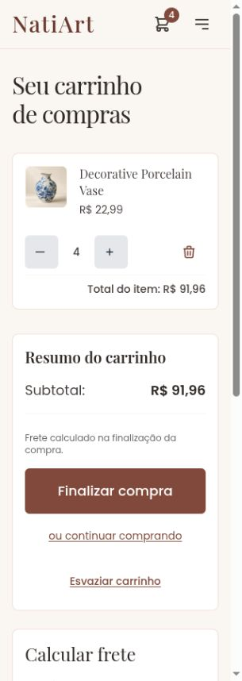
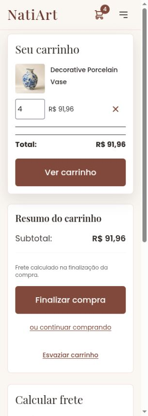
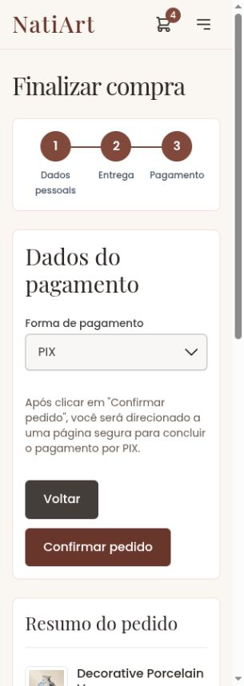
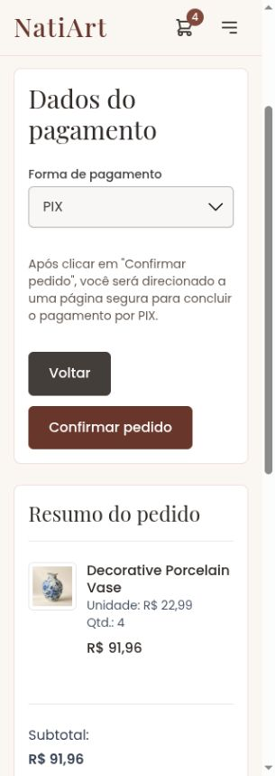

# Integration verification — October 8, 2026

Combined the atelier work with upstream master `f38a1c5a`. Preserved the new
responsive cart layout, localized removal confirmations, wrapping product
quantity controls, shared search/pagination buttons and three-column checkout
progress. Retained atelier photography, product links, mobile summary priority,
validated preview quantity updates and keyboard focus recovery. Shared buttons
now have minimum width and height of 44px.

The three original work commits remain in the integration history:
`ab8fb376` (authentication cache), `6df01450` (storefront) and `3339bd65` (review evidence).

## Combined-tree checks

- Production build passed for English and Brazilian Portuguese. All 496 active
  message IDs have Portuguese translations. Existing locale-data/CommonJS
  warnings remain.
- 382 ChromeHeadless frontend tests passed after the final touch-target change.
- Java25 Gradle builds passed for both services, including formatting checks:
  product 503 tests and directory 161 tests, zero failures/errors/skips.
  Required executed boundary suites passed their report validator.
- Production artifact verification and its five regression tests passed.
- [34 additional browser checks](integration-layout-checks.json) cover the cart
  in both locales at 320/360/390/768/1024/1440px, preview at 320/390/768/1440px,
  all three checkout steps in both locales at 320px, English payment at tablet
  and desktop sizes, and product detail in both locales at 320/768/1440px.
  No document overflow or measured control/progress viewport clipping.
  Visible cart action targets measured at least 44 by 44px.
- Portuguese final submission reads “Confirmar pedido”; English reads “Place
  Order”. Step headings receive focus, and the authoritative local fixture
  quote is R$91.96 + R$23.90 = R$115.86. No order was placed during integration.
- Owner-supplied local fixture files remain untracked and unchanged. They are
  not bundled into this publication. Source whitespace verification passed.

Final phone captures:

The earlier 160-layout review and performance measurements are retained as
pre-integration evidence. Their remaining validation limits still apply.
GitHub CI is required before the master publication; its outcome is recorded
in the pull request and final delivery message. No production deployment.
