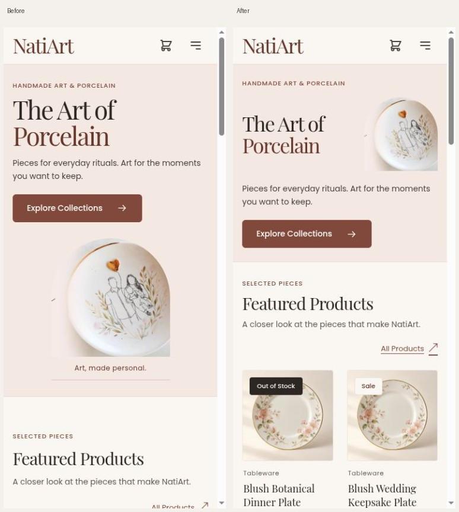
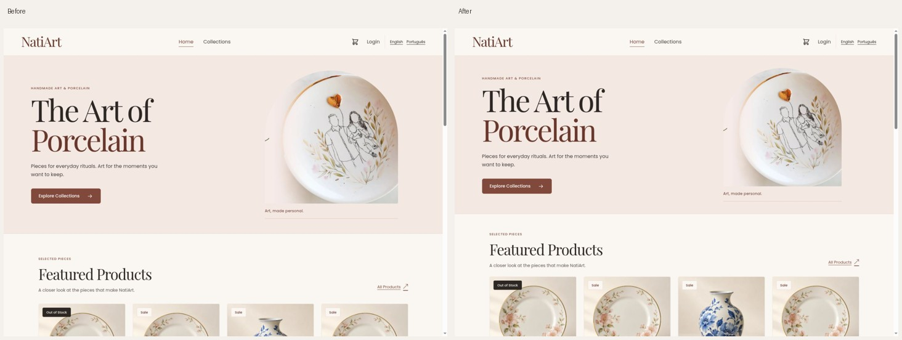
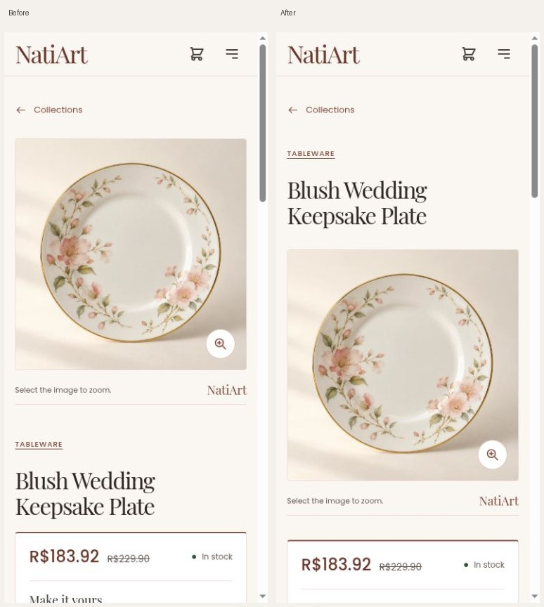
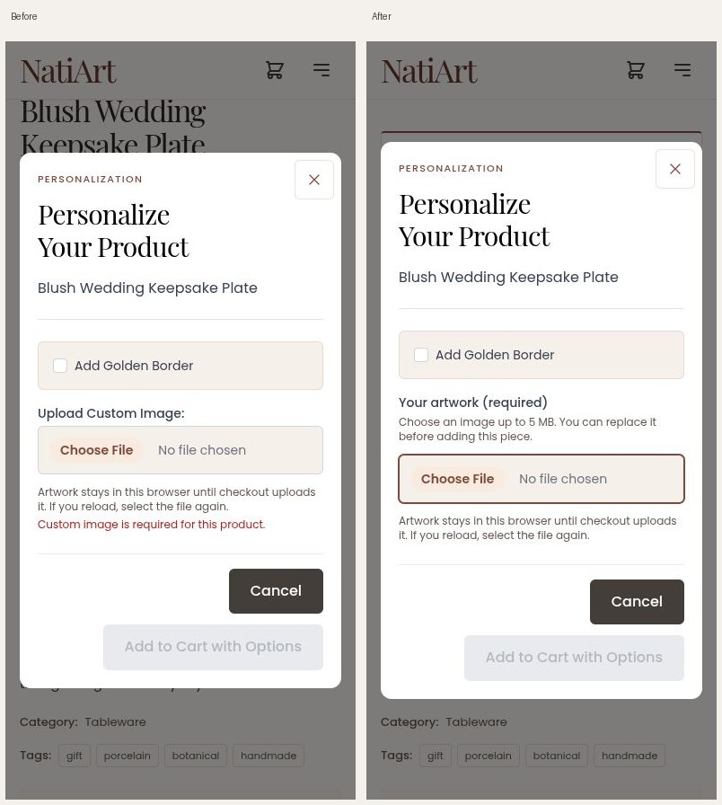

# NatiArt: discovery through repeat purchase

Review date: 2026-10-09. Implemented on `feature/atelier-discovery`, from
`05fd7a44`. This is a focused continuation of the existing atelier, gallery,
shopping and full-route reviews. Findings below were reproduced against that
merged application; earlier proposals are not presented as newly implemented.

**Preview:** [English](http://localhost:4400/en/dashboard) ·
[Português](http://localhost:4400/pt-BR/dashboard).

## Delivered

- A compact phone hero keeps the porcelain visible beside the title. At 390px,
  the first product photo moves from y=896.83 to y=601.48 in English and from
  y=919.92 to y=624.58 in Portuguese. At 320px it moves roughly 320px earlier.
  Collections filters/search and section introductions also use less space.
- One accessible product link per shared card, with a full-card focus outline.
  Prices, availability and personalization remain visible. Related cards reuse
  this same component. Product titles now precede the gallery on phones.
- Search/category/page context survives detail, related pieces, the visible
  Collections return link and a locale switch. Browser Back retains the shell's
  existing scroll restoration.
- Required artwork is explained before purchase. The options dialog starts with
  neutral guidance, displays an original-image preview after valid selection,
  retains options on failure, and releases preview URLs correctly.
- PIX pending, loading, confirmed and recovery screens use the shared visual
  system. Reload checks backend status before showing a code. Confirmed status
  links to the authorized order, and the celebration respects reduced motion.
- Both locale production builds and **445 frontend specs** pass. Two disposable
  purchases completed, with recovery, order inspection and repeat shopping.

The existing shared fonts, semantic colors, fields, dialogs, account screens,
checkout and administration are retained and rechecked. No dependencies,
commercial images, backend production code, tracking service or deployment were
added. The pre-existing untracked `backend/design-review/` work was preserved.

## Evidence

Home, same locale and viewport, before / after:

Product and options detail:

See [audit and priorities](audit.md), [design decisions and checklist](design-system.md),
[route and verification coverage](verification.md), and [measurement plan](measurement.md).
Original screenshots remain in `baseline/` and `final/`; `baseline/layout.json`
and `responsive-checks.json` hold layout observations. QA contact sheets show the
retained phone/desktop captures. An incorrectly framed baseline product-desktop
capture was excluded; no desktop product comparison is claimed.

## Important limits

- New native artwork file selection/upload was blocked by the Chrome extension's
  file-URL permission. The file, preview, validation, failed-submit retention and
  URL-cleanup behavior passed automated tests; the new native upload journey is
  still unverified. No extension permissions were changed.
- Automated Home accessibility scoring is 100; this is not WCAG certification.
  Keyboard checks and 320px reflow passed. Browser zoom shortcuts did not change
  the controlled viewport, so actual 400% zoom and assistive-technology reading
  remain separate checks. Browser reduced-motion emulation is unavailable here;
  the celebration's suppression has an automated regression test.
- Cold mobile lab LCP remains around five seconds. No field p75, INP, conversion
  gain or retention gain is established.
- Verified maker information, localized commercial product content, production
  preparation/shipping/returns policies and contact/privacy content remain owner
  dependencies. Existing unpublished business-page links stay omitted.

The fixture uses synthetic accounts, addresses, rates and test-only PIX codes.
Repeated demo photographs/descriptions are deliberate fixtures, not commercial
catalog defects. The existing approved hero asset is unchanged.
