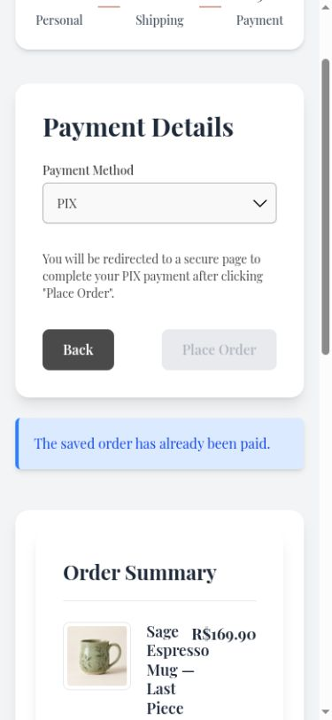
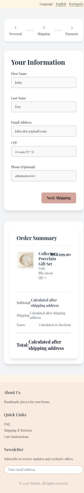

# Start a fresh checkout after completed payment

After a completed PIX purchase, a new basket could reopen the paid attempt and leave Place Order disabled. Completion now clears only the matching saved attempt; terminal reconciliation resets checkout to Personal, and resumed orders display their saved item and price snapshots.

Before: master `aa473518fe8dff824e49371a07881673456cf8b8`.
After: source commit `50d6e560bb0cbf3f8e85c93afa0abaf381927e2c` on `codex/fix-repeat-checkout`.

Screenshots use the local services and synthetic review fixtures. Product photography, customer address, artwork, and payment data are demonstration data; the PIX code is non-payable.

Completed a local PIX purchase through the real webhook flow, added a different product, and verified Personal with an enabled Next: Shipping control and the new basket.

Validation: 363 frontend tests and English/Portuguese production builds passed.

The combined changes also passed 375 frontend tests and 661 backend tests. These images show this fix alone; other findings may remain visible until their separate PRs are merged.

390 × 844, after resuming an already paid attempt versus a fresh checkout after payment completion. The after capture includes the full page.

