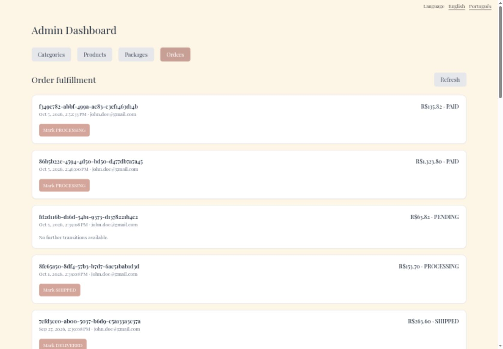
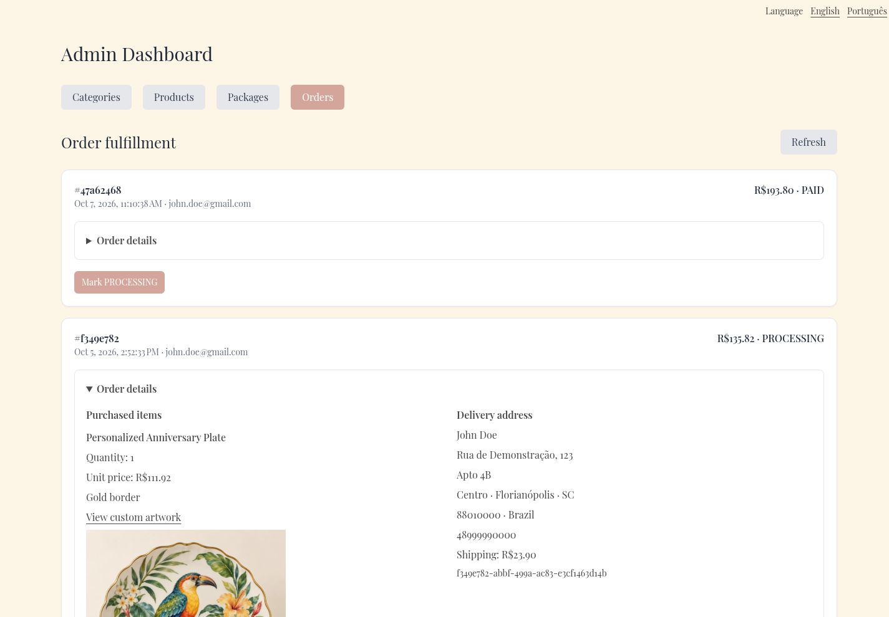

# Show order fulfillment details and authorized artwork

Admin Orders lacked the items, delivery address, gold selections, and custom artwork needed to prepare purchases. Expandable details now show saved order information and load artwork through an admin-only endpoint that verifies the upload belongs to the order.

Before: master `aa473518fe8dff824e49371a07881673456cf8b8`.
After: source commit `6278bd7b6883e3a41ba20b184b4bfc9bd5143a79` on `codex/fix-order-fulfillment-details`.

Screenshots use the local services and synthetic review fixtures. Product photography, customer address, artwork, and payment data are demonstration data; the PIX code is non-payable.

Opened the actual personalized fixture purchase and inspected quantities, unit price, gold selection, shipping address, and the stored artwork. Backend tests cover authorization, membership, upload ownership, and consumed/ready state.

Validation: 361 frontend tests and English/Portuguese production builds passed. Product service: 500 tests passed on Java 25.

The combined changes also passed 375 frontend tests and 661 backend tests. These images show this fix alone; other findings may remain visible until their separate PRs are merged.

1440 × 1000 admin order list before and expanded personalized purchase after.

The same expanded purchase scrolled to show the complete stored artwork.

