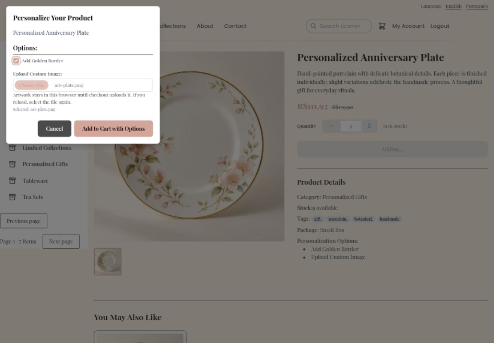
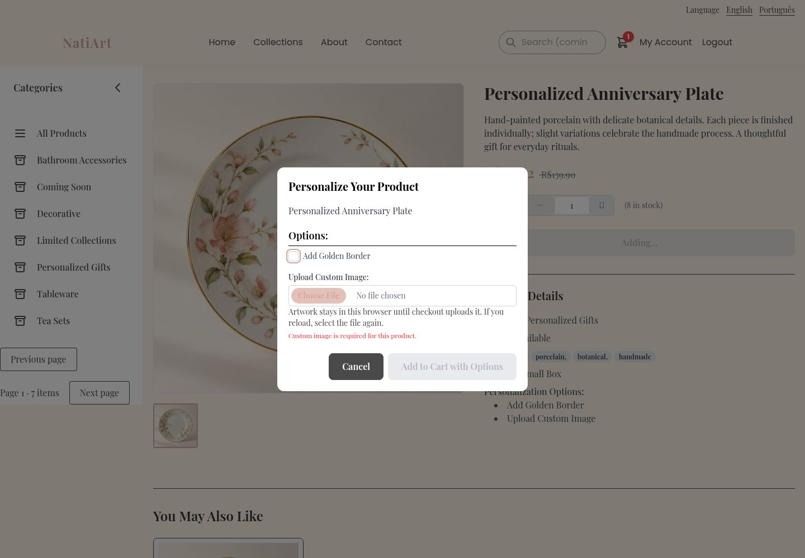
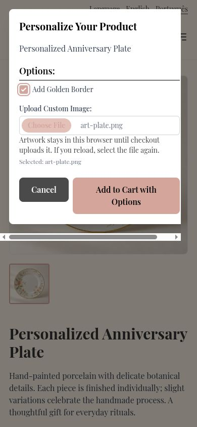
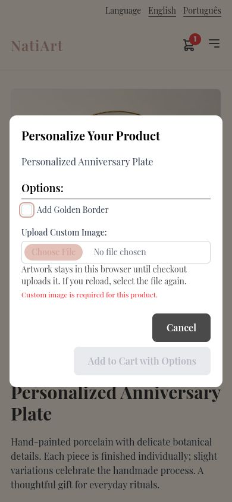
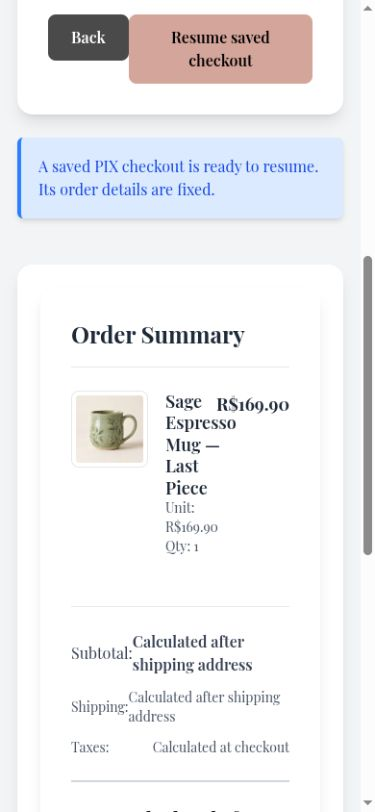
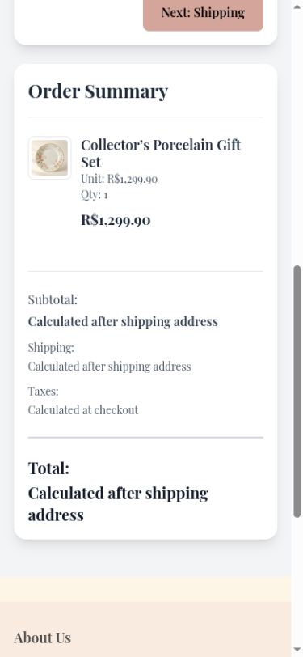

# Fix phone checkout, dialog, and admin layouts

Long product names and prices overlapped in checkout; dialogs overflowed on phones and appeared at the desktop corner; admin tabs widened the document. Responsive summary rows now place prices below item details, dialogs are centered and bounded, and admin tabs wrap.

Before: master `aa473518fe8dff824e49371a07881673456cf8b8`.
After: source commit `9bf24163af394ea9d8352acd900c8e42da0505f0` on `codex/fix-responsive-commerce-layout`.

Screenshots use the local services and synthetic review fixtures. Product photography, customer address, artwork, and payment data are demonstration data; the PIX code is non-payable.

Checked personalization at 1440 × 1000 and 390 × 844, the long gift-set checkout summary at 390 pixels, and admin navigation at 320 pixels. Dialog content width equals its client width; the narrow document stays within the viewport.

Validation: 360 frontend tests and English/Portuguese production builds passed.

The combined changes also passed 375 frontend tests and 661 backend tests. These images show this fix alone; other findings may remain visible until their separate PRs are merged.

1440 × 1000 personalization dialog.

390 × 844 personalization dialog.

390 × 844 long-name checkout summary.

