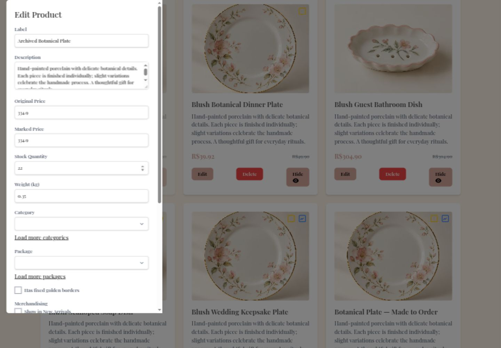
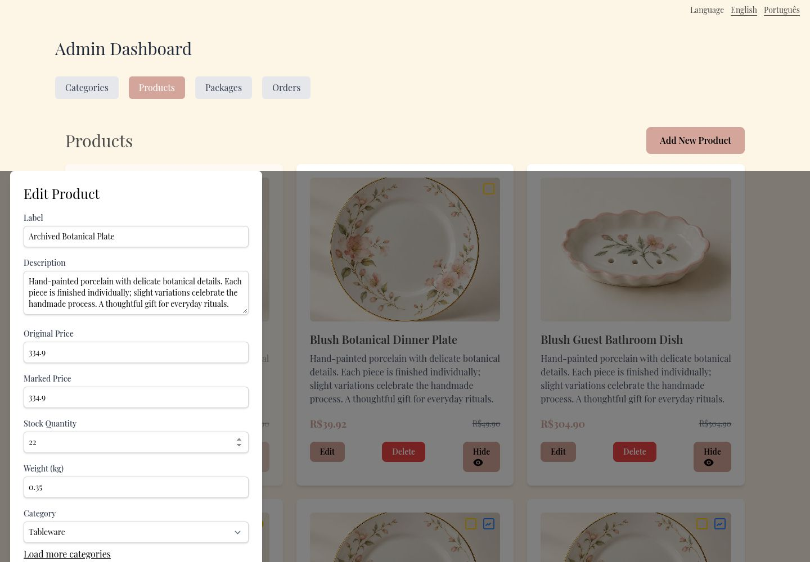

# Keep saved references visible in the product editor

Editing a product whose category or package lay beyond the first options page displayed blank selectors. The editor now retains selected DTO references while options load, labels inactive references, and deduplicates them after pagination.

Before: master `aa473518fe8dff824e49371a07881673456cf8b8`.
After: source commit `63474d9c0d12bf62d87299903dcfa36b4d01fe16` on `codex/fix-admin-selected-references`.

Screenshots use the local services and synthetic review fixtures. Product photography, customer address, artwork, and payment data are demonstration data; the PIX code is non-payable.

Opened Archived Botanical Plate before loading the remaining reference pages: Tableware and Small Box were selected immediately. Loading additional pages retained each selected option exactly once.

Validation: 361 frontend tests and English/Portuguese production builds passed.

The combined changes also passed 375 frontend tests and 661 backend tests. These images show this fix alone; other findings may remain visible until their separate PRs are merged.

1440 × 1000 editor with only the first reference page loaded.

