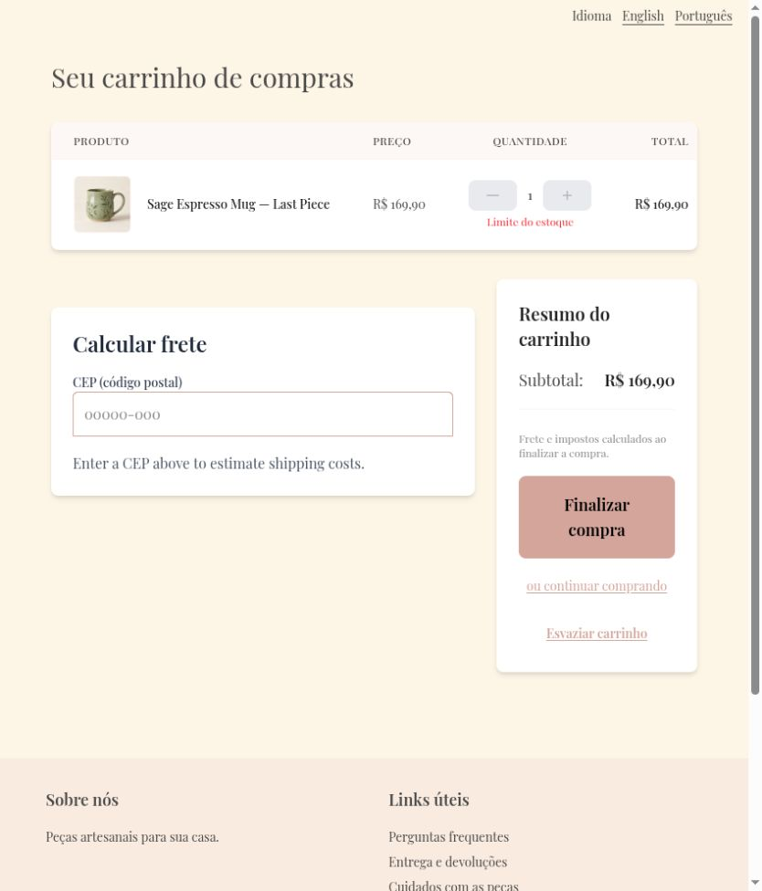
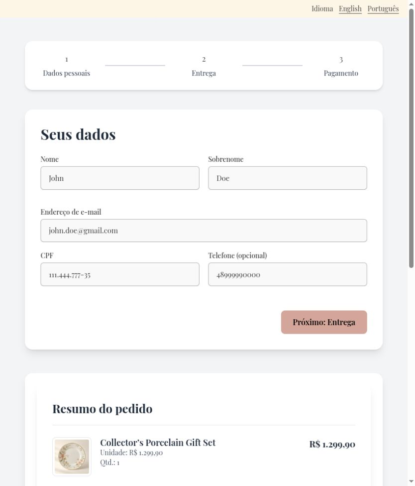

# Keep language links synchronized with the current route

Language links could retain a previous route after in-app navigation. Links now follow router navigation while preserving query parameters, fragments, and existing dirty-form protection.

Before: master `aa473518fe8dff824e49371a07881673456cf8b8`.
After: source commit `4461471469c2d8ea40e5a38488a723a256cccd8a` on `codex/fix-language-route-sync`.

Screenshots use the local services and synthetic review fixtures. Product photography, customer address, artwork, and payment data are demonstration data; the PIX code is non-payable.

Started at Cart, navigated to Checkout, and chose Português. Master returned to /pt-BR/cart; the fix remained on /pt-BR/checkout. Router tests also cover query and fragment preservation.

Validation: 361 frontend tests and English/Portuguese production builds passed.

The combined changes also passed 375 frontend tests and 661 backend tests. These images show this fix alone; other findings may remain visible until their separate PRs are merged.

Default desktop viewport: result of Cart → Checkout → Português. Before shows Cart; after shows Checkout.

