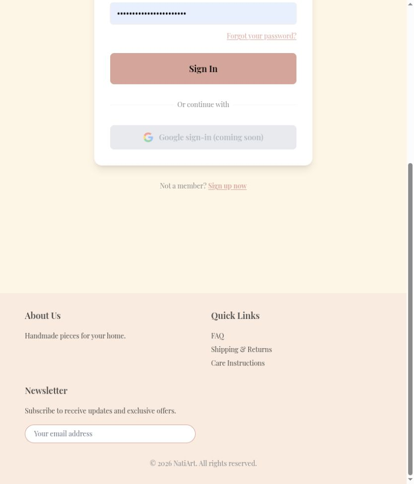
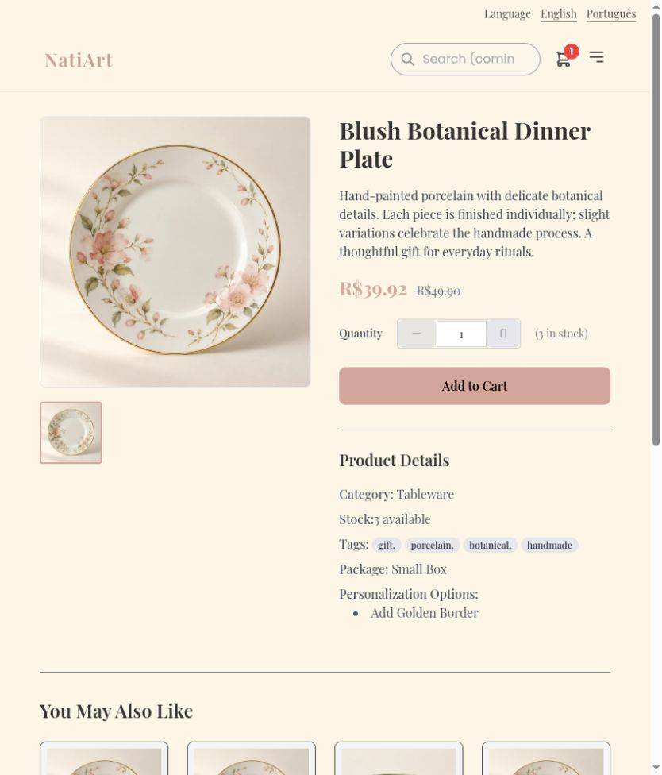

# Allow guests to browse the storefront and product details

Guests could see the catalog but had to sign in to inspect a product or visit the storefront landing page. Landing, product detail, and the browser-local basket are now public; checkout, account, payment, and admin retain their guards.

Before: master `aa473518fe8dff824e49371a07881673456cf8b8`.
After: source commit `f20bc7fb6a2d67c30bd367292b7199e541c6075a` on `codex/fix-public-shopping`.

Screenshots use the local services and synthetic review fixtures. Product photography, customer address, artwork, and payment data are demonstration data; the PIX code is non-payable.

Verified an anonymous product detail visit and guest cart access, then confirmed Proceed to Checkout opens Login. A real router/HTTP journey test checks destination and basket preservation.

Validation: 361 frontend tests and English/Portuguese production builds passed.

The combined changes also passed 375 frontend tests and 661 backend tests. These images show this fix alone; other findings may remain visible until their separate PRs are merged.

Default desktop viewport: the same anonymous product-detail destination, login gate before and product details after.

