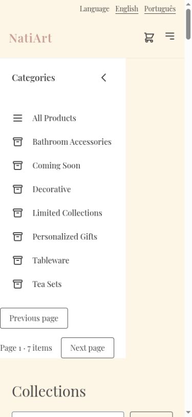
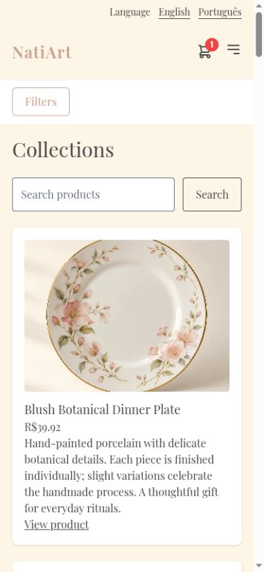
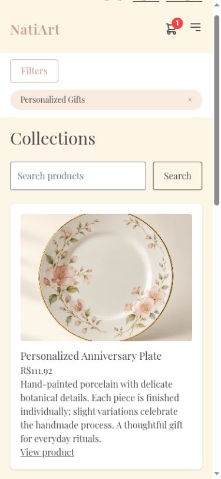

# Collapse mobile category filters and show the selection

Expanded categories pushed the catalog heading and products below the first phone screen. Mobile filters now start collapsed, close after category selection, and show a removable category chip; desktop keeps its sidebar.

Before: master `aa473518fe8dff824e49371a07881673456cf8b8`.
After: source commit `e23b5101fb580323cceaab798569feab4ee66b06` on `codex/fix-mobile-category-filters`.

Screenshots use the local services and synthetic review fixtures. Product photography, customer address, artwork, and payment data are demonstration data; the PIX code is non-payable.

Checked 390 × 844 and 320-pixel layouts, opened Filters, selected Personalized Gifts, and verified the panel closes while its chip remains visible.

Validation: 360 frontend tests and English/Portuguese production builds passed.

The combined changes also passed 375 frontend tests and 661 backend tests. These images show this fix alone; other findings may remain visible until their separate PRs are merged.

390 × 844 initial catalog.

390 × 844 after choosing Personalized Gifts; the selected chip remains visible with the panel closed.

