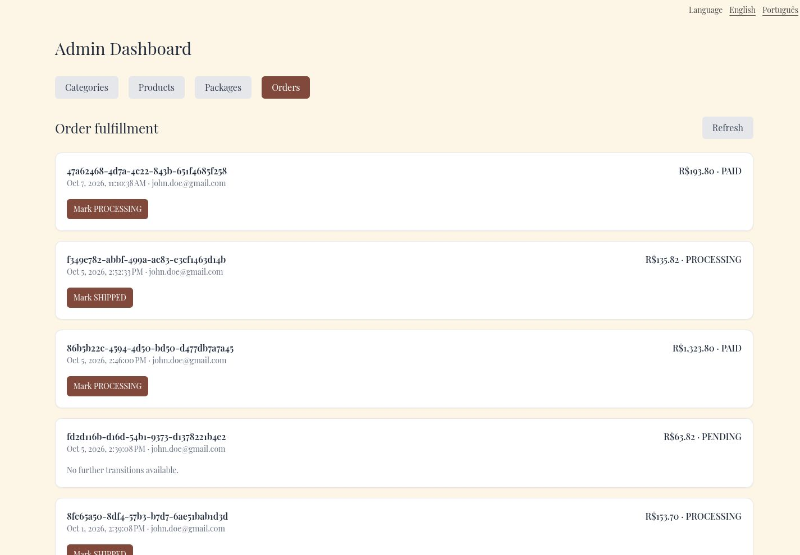

# Improve text and enabled action contrast

White text on enabled pale-pink actions and pink text on cream fell below ordinary-text contrast requirements. Dark rose now serves text/actions, pale blush remains on surfaces, and semantic button colors use readable foreground/background combinations.

Before: master `aa473518fe8dff824e49371a07881673456cf8b8`.
After: source commit `f0616343f7614293cade7358646088c4b47a6104` on `codex/fix-action-text-contrast`.

Screenshots use the local services and synthetic review fixtures. Product photography, customer address, artwork, and payment data are demonstration data; the PIX code is non-payable.

The rendered enabled fulfillment action is white on rgb(128,73,59), approximately 7.16:1. Computed-style tests check normal enabled text and semantic action combinations at 4.5:1 or greater.

Validation: 361 frontend tests and English/Portuguese production builds passed.

The combined changes also passed 375 frontend tests and 661 backend tests. These images show this fix alone; other findings may remain visible until their separate PRs are merged.

1440 × 1000 enabled fulfillment actions.

