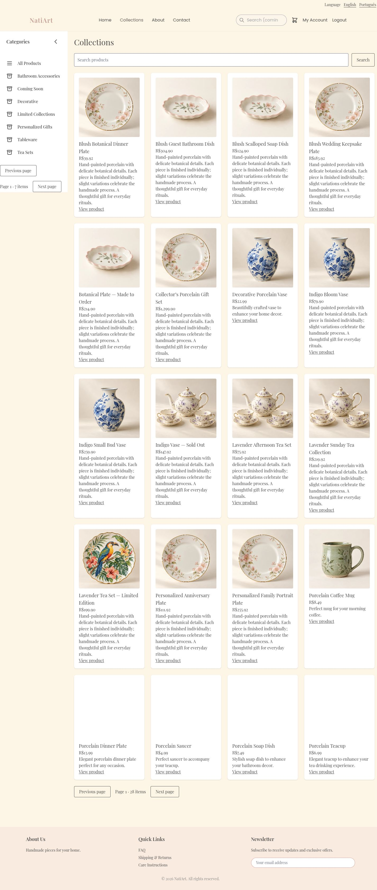
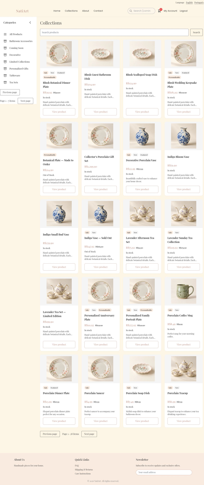

# Share consistent product cards with purchase information

Catalog cards omitted sale comparisons, stock, personalization, and merchandising signals, and long descriptions made scanning difficult. Dashboard and catalog now use one card with a fixed image ratio, concise text, current/original prices, availability, badges, and a consistent detail action.

Before: master `aa473518fe8dff824e49371a07881673456cf8b8`.
After: source commit `b409a729ac046c21ee3abedb582843f064022492` on `codex/fix-consistent-product-cards`.

Screenshots use the local services and synthetic review fixtures. Product photography, customer address, artwork, and payment data are demonstration data; the PIX code is non-payable.

Inspected the real catalog and dashboard. Component tests cover failed-image fallback and replacement, availability, and personalization changes; existing dashboard image ownership and cart behavior are retained.

Validation: 361 frontend tests and English/Portuguese production builds passed.

The combined changes also passed 375 frontend tests and 661 backend tests. These images show this fix alone; other findings may remain visible until their separate PRs are merged.

1440 × 1000 viewport, full catalog page before and after.

