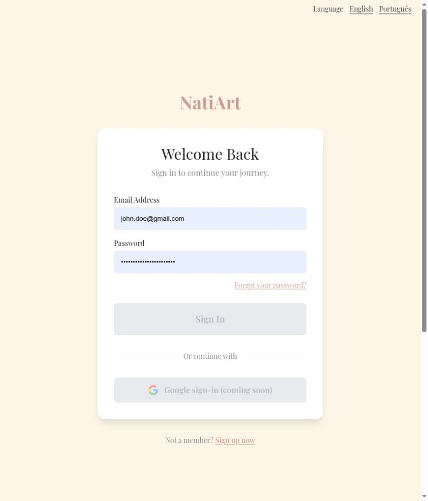
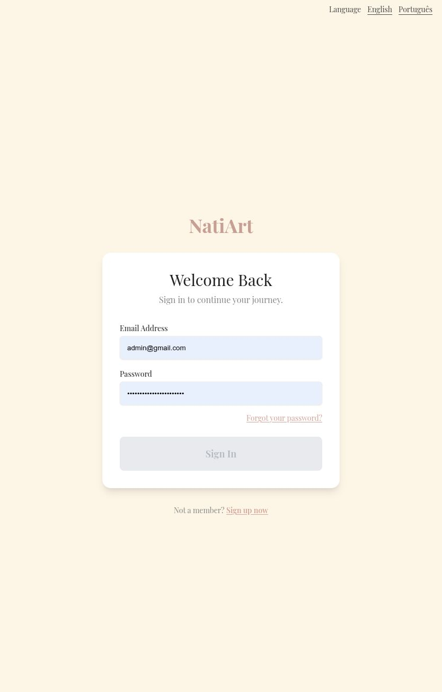

# Remove unfinished storefront links and controls

Unavailable business pages, Google sign-in, wishlist, header search, and newsletter controls occupied prominent space. These unfinished features and generic maker-story content are removed; retired business-page URLs redirect to Collections. Existing care content remains accessible.

Before: master `aa473518fe8dff824e49371a07881673456cf8b8`.
After: source commit `416fca37ef902a7d2a189fceaf9b52f94e5cd998` on `codex/remove-unfinished-storefront-controls`.

Screenshots use the local services and synthetic review fixtures. Product photography, customer address, artwork, and payment data are demonstration data; the PIX code is non-payable.

Verified login/footer controls and the retired shipping page redirect. Route and navigation tests check the available links. This follows the requested removal approach without inventing business details.

Validation: 360 frontend tests and English/Portuguese production builds passed.

The combined changes also passed 375 frontend tests and 661 backend tests. These images show this fix alone; other findings may remain visible until their separate PRs are merged.

Default desktop viewport, full login page before and after.

