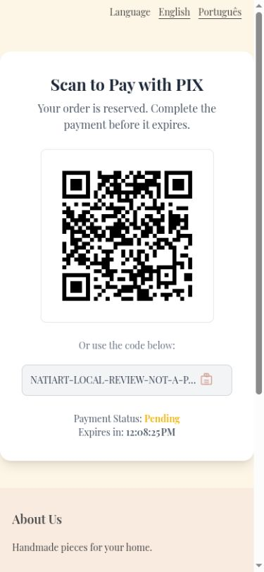
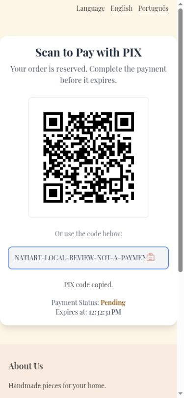
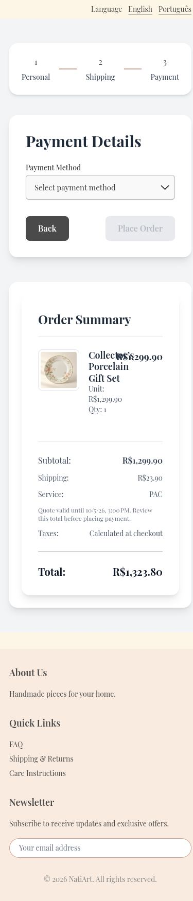
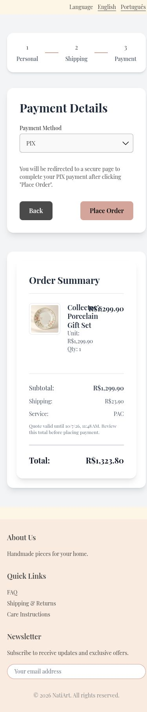
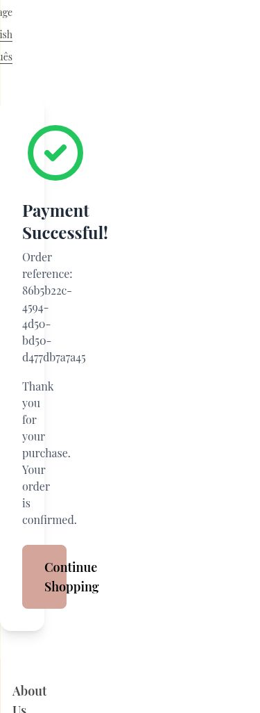
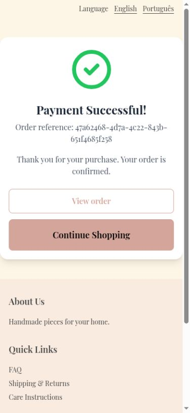

# Clarify PIX feedback, final costs, and order access

PIX copying lacked an accessible label and success feedback, expiry showed a clock time under Expires in, final checkout retained a tax placeholder, and success offered no order link. Copy is named and announced, expiry says Expires at, PIX is preselected, final costs show actual charges, and View order opens the owned purchase.

Before: master `aa473518fe8dff824e49371a07881673456cf8b8`.
After: source commit `713201cb3c622dac948a18bed2b3ef792f4b5165` on `codex/fix-pix-checkout-feedback`.

Screenshots use the local services and synthetic review fixtures. Product photography, customer address, artwork, and payment data are demonstration data; the PIX code is non-payable.

Verified successful-copy feedback with the inert local PIX fixture, preselected PIX and a server-backed item-plus-shipping total, then opened the purchased order through View order. Tests also cover copy failure and an unavailable order returning to history.

Validation: 362 frontend tests and English/Portuguese production builds passed.

The combined changes also passed 375 frontend tests and 661 backend tests. These images show this fix alone; other findings may remain visible until their separate PRs are merged.

390 × 844 pending PIX: copy feedback and expiry wording.

390 × 844 final payment step and cost breakdown; after includes the full page.

390 × 844 successful payment with the direct View order action.

