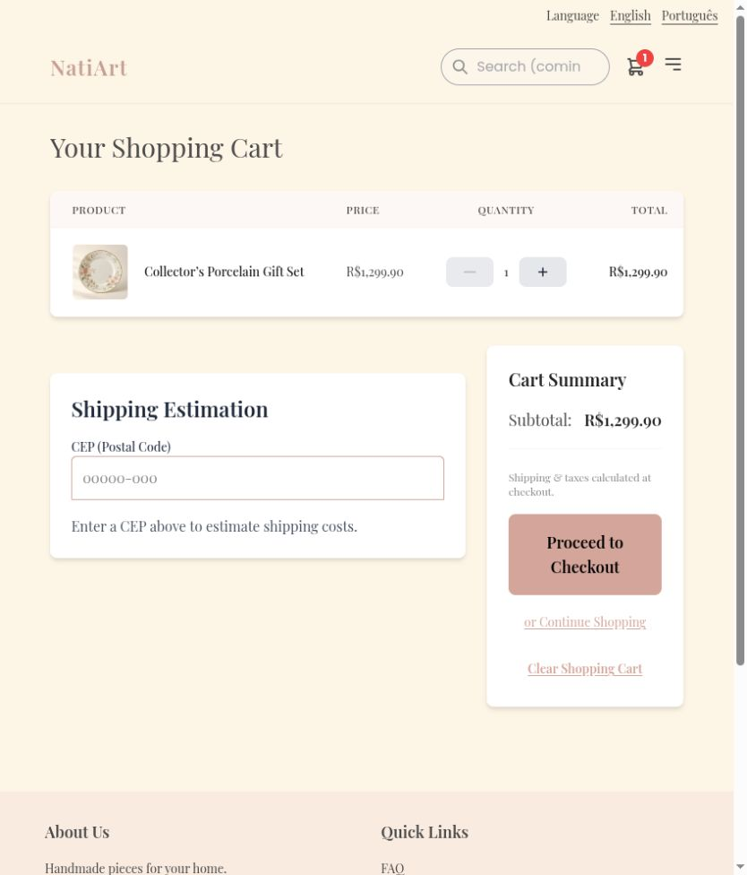

# Keep navigation, heading focus, and Back position across pages

Cart, checkout, and admin lacked the normal store header, and navigation retained stale scroll positions. The shell now owns one header, focuses each rendered route heading, starts new routes at the top, and restores Back after asynchronous content renders.

Before: master `aa473518fe8dff824e49371a07881673456cf8b8`.
After: source commit `c4bcfb106d461bc0045d08ca135e49e867e80c04` on `codex/fix-store-navigation-continuity`.

Screenshots use the local services and synthetic review fixtures. Product photography, customer address, artwork, and payment data are demonstration data; the PIX code is non-payable.

Verified Cart header and focused heading. From catalog scroll position 1988, a native product click opened at 0; Back returned to exactly 1988 after products loaded. Tests cover async headings, busy content, one-time restoration, and new-route reset.

Validation: 362 frontend tests and English/Portuguese production builds passed.

The combined changes also passed 375 frontend tests and 661 backend tests. These images show this fix alone; other findings may remain visible until their separate PRs are merged.

Default desktop viewport, cart before and after.

