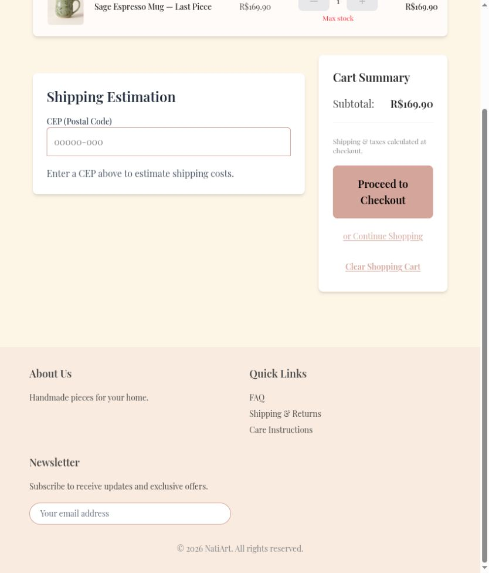
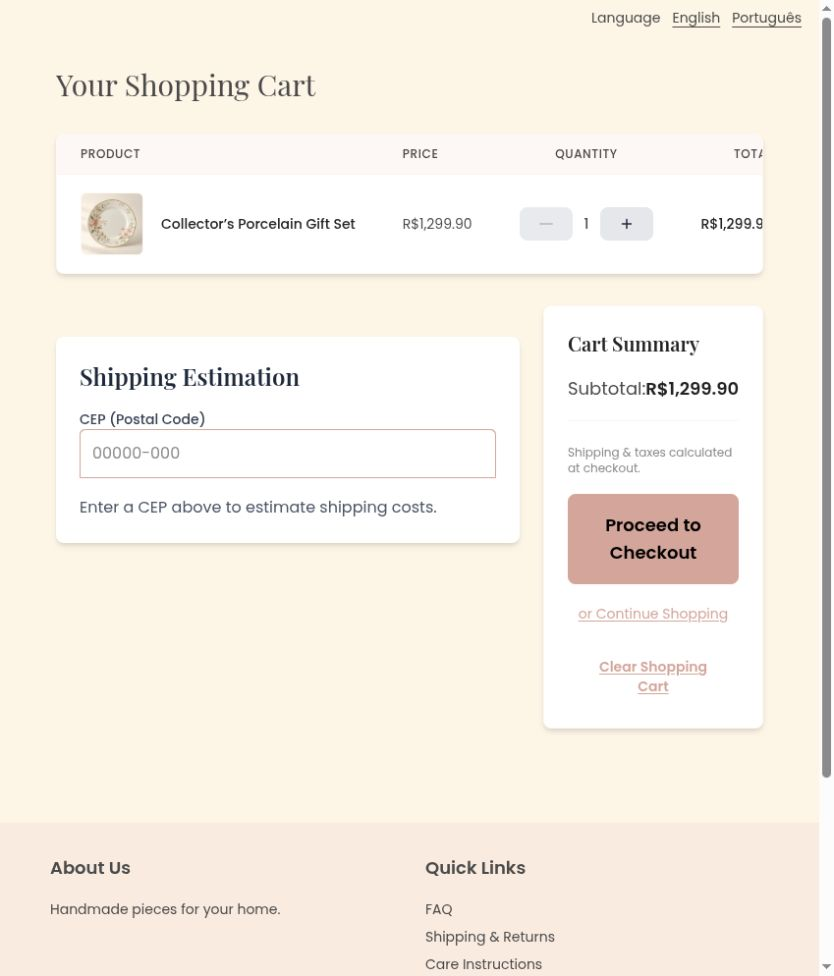

# Unify body typography and shared controls

Body copy and forms inherited serif text inconsistently; search/pagination and quantity controls differed across screens. Poppins now supplies body text, Playfair remains on headings, shared buttons have consistent heights, and product quantity controls use SVG icons.

Before: master `aa473518fe8dff824e49371a07881673456cf8b8`.
After: source commit `7ffa0a004f6667fb36883a40bc14c79bc6828029` on `codex/fix-storefront-typography-controls`.

Screenshots use the local services and synthetic review fixtures. Product photography, customer address, artwork, and payment data are demonstration data; the PIX code is non-payable.

Checked rendered cart body/paragraph styles and shared controls. Existing behavior tests pass and both localized production builds compile.

Validation: 360 frontend tests and English/Portuguese production builds passed.

The combined changes also passed 375 frontend tests and 661 backend tests. These images show this fix alone; other findings may remain visible until their separate PRs are merged.

Default desktop viewport, cart body typography before and after.

