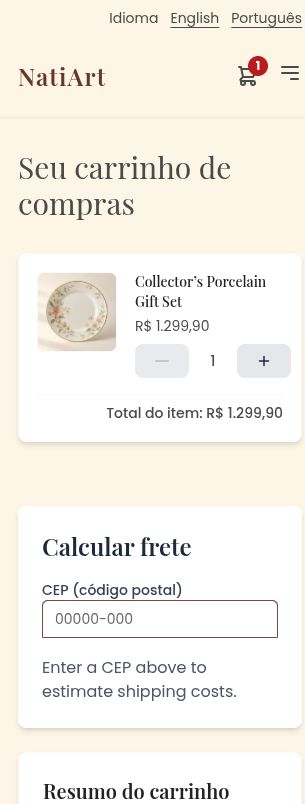
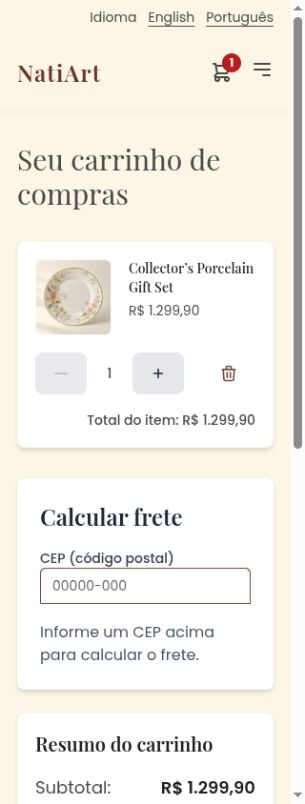
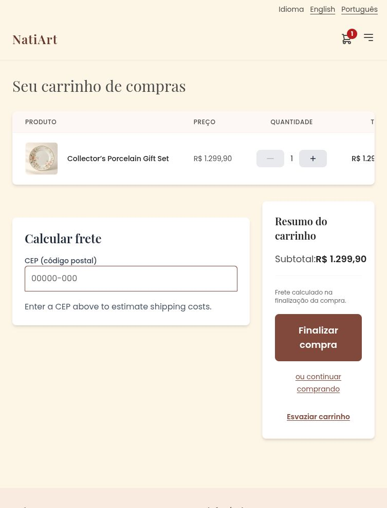
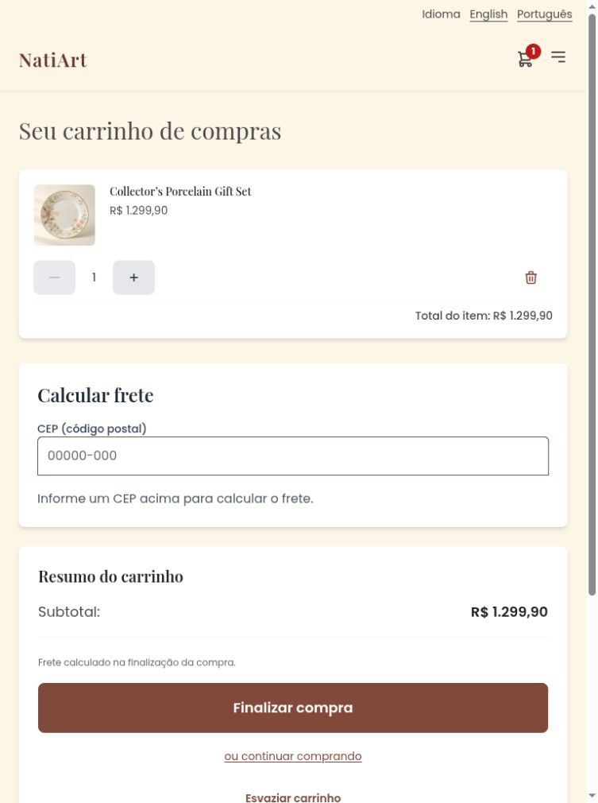
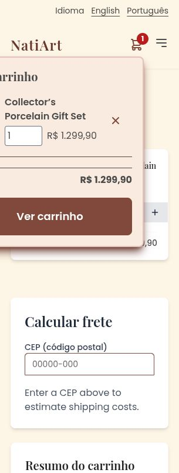
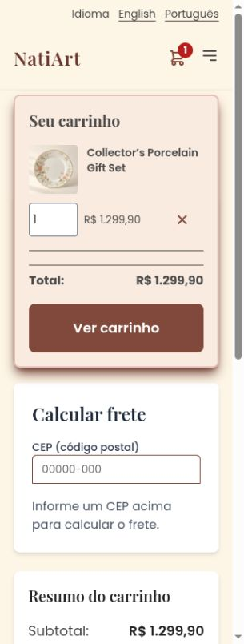

# Cart review follow-up for PR #398

Addresses the [three remaining cart findings](https://github.com/Finrood/NatiArt/pull/398#issuecomment-6044529281): phone removal clipping, tablet totals/actions cropping, and the phone preview extending past the left edge.

Before: published PR head `2891a104e778d127b27cce6c63f5e005b1188532`.
After: source `fac289e3509a51330b3b27e444245d5a46eac119`.
Base: approved master `1e9221191a5588d08b437035bfc6a77044b3a7de`.

Screenshots use the real production English/Portuguese bundles and local H2 services. Products, prices, photographs and shipping quotes are synthetic demonstration fixtures. The comparisons show the same Collector’s Porcelain Gift Set at quantity one.

## Changes

- Phone and tablet cards have a shrinkable image/details row and a separate wrapping quantity/removal row. The outer overflow mask is removed.
- Cards remain through tablet widths; the complementary table/card classes switch together at `lg`. The desktop table bounds its columns, wraps details, and reduces padding at the breakpoint.
- Phone/tablet preview positioning uses the full-width header and side gutters. Desktop retains the cart-icon anchor. Item details and the separate action grid can shrink, and the panel scrolls within short screens.
- Quantity/removal targets are at least 44 × 44 px, including disabled controls. Preview quantities have translated labels and visible focus styling.
- Portuguese removal messages, confirmation action and shipping states are translated. Shipping prices use locale-aware currency formatting. The cart grid supplies shipping-panel spacing so desktop panels align.

## Before and after

| Phone cart, 320 px — before | After |
| --- | --- |
|  |  |

| Tablet cart, 768 px — before | After |
| --- | --- |
|  |  |

| Phone preview, 320 px — before | After |
| --- | --- |
|  |  |

## Validation

375 frontend tests passed with Chromium. English and Portuguese production builds passed, as did the production artifact verifier and its five tests. Backend implementation is unchanged relative to master.

[Recorded bounds](measurements.json) cover **48 cases**: cart and preview in both languages at 320, 360, 390, 768, 1024 and 1440 px, first with the Collector’s item, then with an additional long-title Lavender Tea Set at quantity 13. All cases have document width no greater than usable viewport width. Every recorded visible element fits horizontally, has no clipping ancestor hiding it, and has no text or table-cell overflow. Quantity/removal targets meet 44 × 44 px. Vertical scrolling remains intentional.

| Reproduction | Before | After |
| --- | --- | --- |
| Phone remove button, 305 px usable width | x=309–365, hidden by card | x=212–268, visible |
| Tablet remove button, 753 px usable width | x=811–867, hidden by container | x=654–710, visible |
| Phone preview heading/navigation, 305 px usable width | start x=-55 | x=38–267 |

The baseline JSON files retain the individual bounds and clipping ancestors, including failures masked by equal document/viewport widths.

Actual browser operations checked:

- Keyboard Space increases/decreases quantity and updates item/subtotal amounts.
- Quantity 13 disables increasing at the stock limit while preserving the Max stock label.
- Removal confirmation initially focuses Cancel. Escape preserves the line and returns focus to Remove. Confirming removes only the selected temporary item.
- Preview quantity inputs update prices/totals in both languages. Preview removal removes only the selected temporary line; its navigation button opens the cart.
- At 320 × 500, the preview is vertically scrollable with its bottom at y=496; the navigation action can be scrolled into view and activated.
- Portuguese shipping estimates render the translated service, price and delivery labels and localized `R$ 23,90`; [additional bounds](after-shipping-pt-320.json) pass at 320 px.

The review leaves the original Collector’s item at quantity one. Both existing account logins work. Fixture verification passed for 32 products, 34 WebP images, 24 categories, 24 packages and 22 consistent seeded orders. No order or payment was submitted.

## Additional evidence

- [Long-title preview, quantity 13](after-preview-long-pt-320.jpg)
- [Desktop table at its 1024 px breakpoint](after-cart-pt-1024.jpg)
- [Desktop cart, 1440 px](after-cart-pt-1440.jpg)
- [Desktop icon-anchored preview](after-preview-pt-1440.jpg)
- [English removal confirmation](after-remove-confirmation-en-320.jpg) and [returned keyboard focus](after-remove-focus-en-320.jpg)
- [Portuguese removal confirmation](after-remove-confirmation-pt-320.jpg)
- [Portuguese shipping estimate](after-shipping-pt-320.jpg)

The earlier [product/checkout review evidence](../review-followup/README.md) and [original typography comparison](../README.md) remain available.
