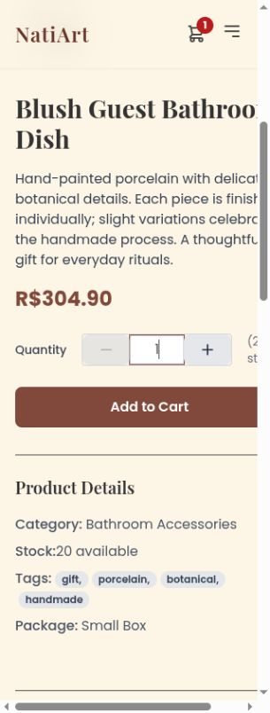
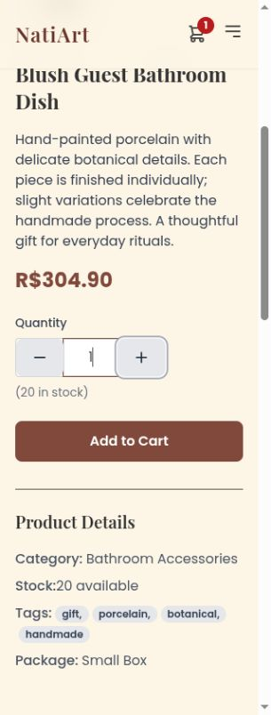
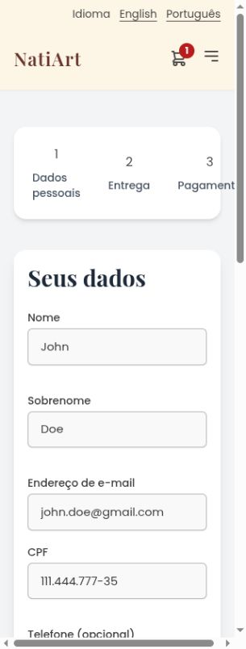
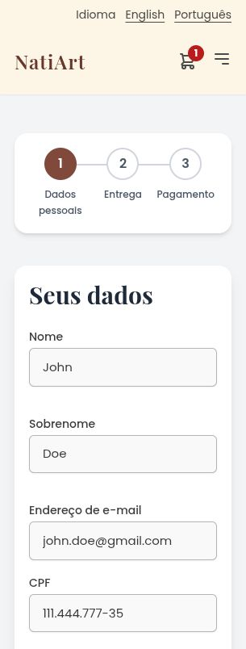
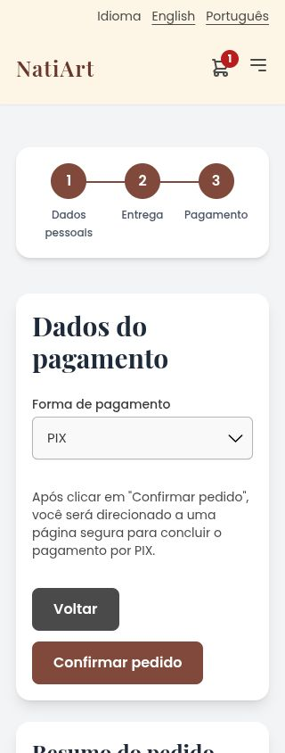
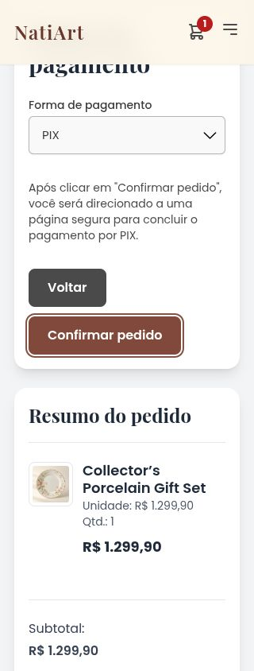
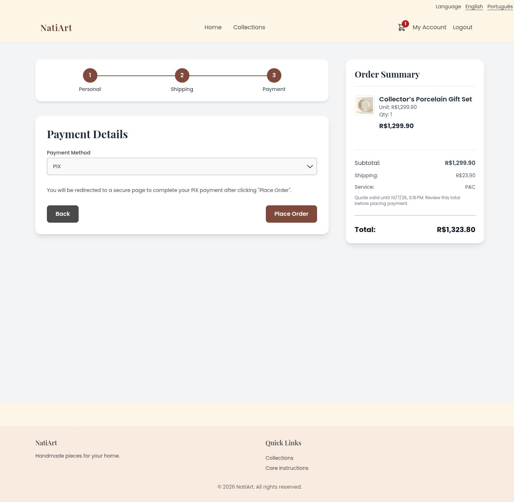
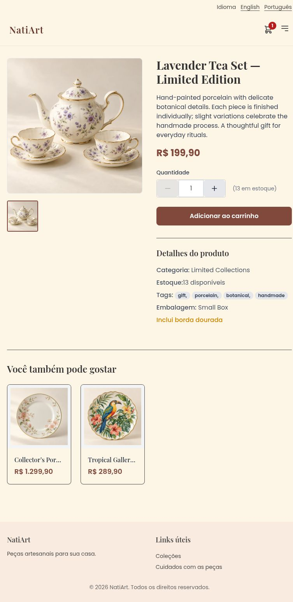

# PR #398 responsive review follow-up

Addresses [the requested changes](https://github.com/Finrood/NatiArt/pull/398#issuecomment-6043302349).

Before: source `c5c14d52c9336b35f837b22714ca95bddb3c9a97`, this PR synchronized with approved master `1e9221191a5588d08b437035bfc6a77044b3a7de`.
After: source `53c6310e80af85e7068188550635c6635e5fd2b0`, compiled production English and Portuguese builds.

At 320 × 844, the before product page had a 354 px document for a 305 px usable viewport. Portuguese checkout had a 315 px document for the same 305 px viewport. Both now fit at 305 px, with all content visible and no document overflow masking.

Quantity labels sit above the controls; stock text wraps naturally beneath them when necessary. Both buttons are 56 × 44 px, and the input is at least 44 px tall. The product column can shrink and long text can wrap. Checkout uses three equal shrinkable columns, centered labels, visible progress circles, decorative connectors between circle centers, and aria-current for the active step. Portuguese checkout actions are extracted as separate messages; the submit action reads “Confirmar pedido,” matching the payment instructions.

## Before and after at 320 px

| Product before | Product after |
| --- | --- |
|  |  |

| Portuguese checkout before | Portuguese checkout after |
| --- | --- |
|  |  |

## Validation

375 frontend browser tests passed. Both production locales compiled, the production artifact verifier passed, and its five tests passed. No backend implementation changed relative to approved master.

The browser matrix covered product detail and all three checkout steps in both languages at 320, 360, 390, 768 and 1440 px: 40 cases. An additional longer-title product with 13 in stock covered both locales at all five widths: 10 cases. The first product had 20 in stock. Keyboard checks exercised quantity input → increase → Space (10 → 11) and the payment action's visible focus ring. Separate billing fields also fit on the Portuguese 320 px shipping step.

[measurements.json](measurements.json) records the 50 observations from the local browser runs, including observations transcribed from tool output. Every case satisfies `document.documentElement.scrollWidth <= document.documentElement.clientWidth` and the observed headings, inputs, buttons and step columns remain within the usable width. Full-page images and viewport images were visually inspected; fitting the document alone was not treated as proof that content was visible.

Screenshots use synthetic local fixtures and generated demonstration product photography. No order or payment was submitted during this follow-up.

