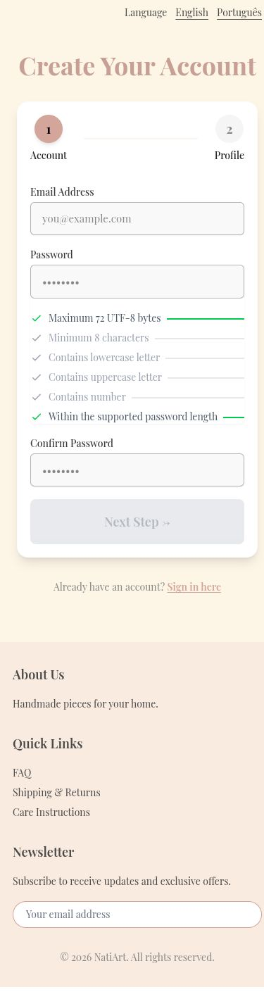
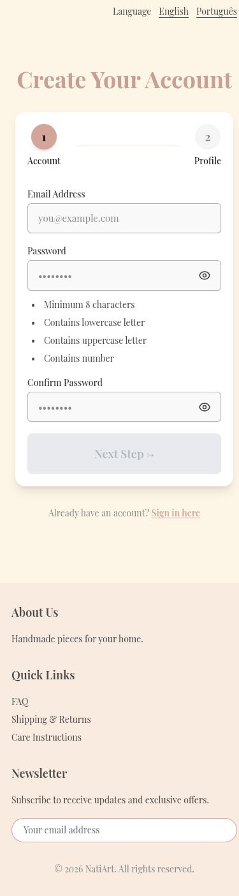
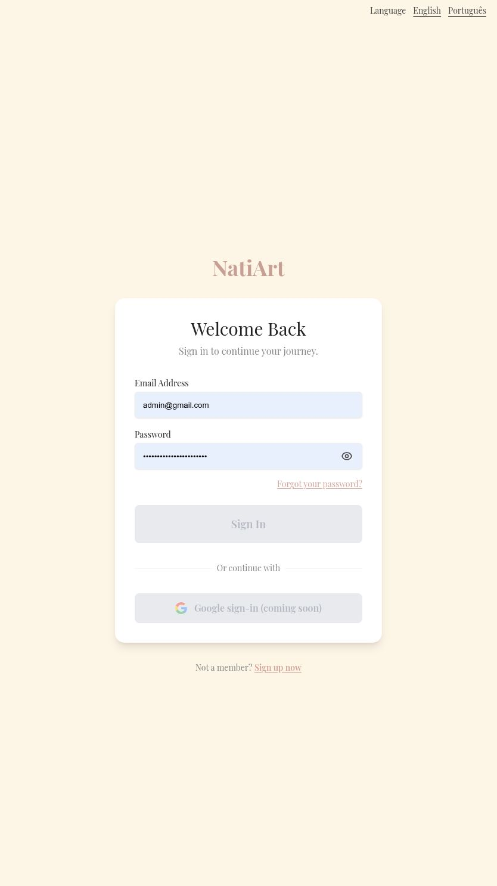

# Simplify password guidance and add Show/Hide

Signup exposed UTF-8 byte terminology and positive length checks before input, while login had no password reveal control. Empty guidance now shows four neutral requirements, oversized passwords receive plain-language feedback, and auth fields support named Show/Hide controls.

Before: master `aa473518fe8dff824e49371a07881673456cf8b8`.
After: source commit `f3a67f476223929a665298cafa585196ffeeee37` on `codex/fix-password-guidance-visibility`.

Screenshots use the local services and synthetic review fixtures. Product photography, customer address, artwork, and payment data are demonstration data; the PIX code is non-payable.

Verified neutral empty signup, the preserved 72-byte validation using multibyte input, and login reveal/hide without submitting or changing the entered value. No account was created.

Validation: 362 frontend tests and English/Portuguese production builds passed.

The combined changes also passed 375 frontend tests and 661 backend tests. These images show this fix alone; other findings may remain visible until their separate PRs are merged.

390 × 844 viewport, full empty signup page before and after.

Default desktop viewport, full login page before and after.

